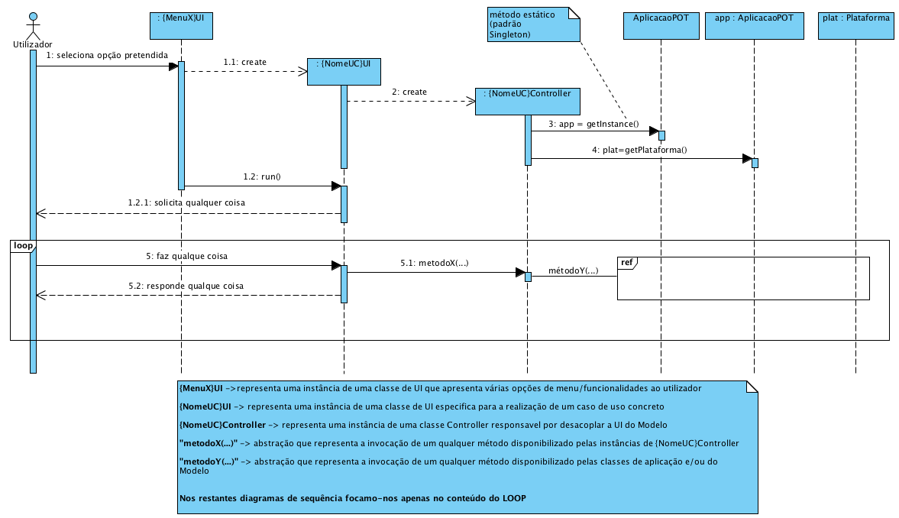
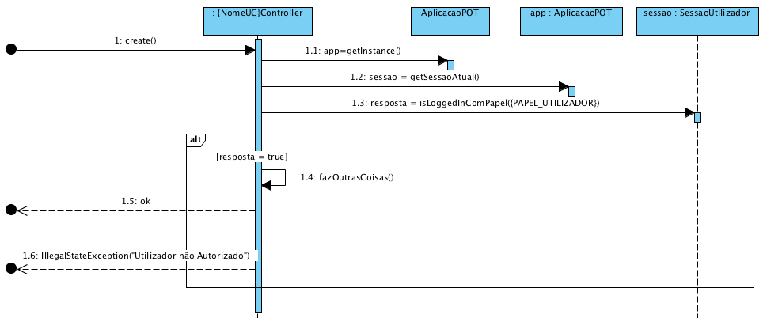

# README #

Este repositório contém artefactos didáticos relavativos ao projeto desenvolvido na Unidade Curricular (UC) de Engenharia de Software (ESOFT) edição de 2019-2020 da [Licenciatura em Engenharia Informática (LEI)](http://www.isep.ipp.pt/Course/Course/26) do [Instituto Superior de Engenharia do Porto (ISEP)](http://www.isep.ipp.pt).

Em particular, contém:

* [Descrição do projeto (por iteração)](docs/README.md)
* Proposta de resolução para as atividades de Engenharia de Requisitos, Análise e Design OO
* Código fonte disponilizado aos estudantes como ponto de partida
* Descrição do funcionamento geral da aplicação disponibilizada

### Funcionamento Geral da Aplicação

O diagrama de sequência seguinte representa graficamente o fluxo pretendido para a aplicação onde existe uma separação clara (desacoplamento) entre as classes de domínio e as classes de interação com o utilizador (_user interface_). Este desacoplamento é realizado pelas classes com o sufixo _Controller_.

Nesta UC pretende-se que os estudantes se concentrem essencialmente na construção das classes de domínio (cf. documentação).
 

A realização de algumas funcionalidades pelos utilizadores carece de uma autorização baseada em papeis/funções desempenhadas.
A verificação dessa autorização pode ser realizada da seguinte forma:

