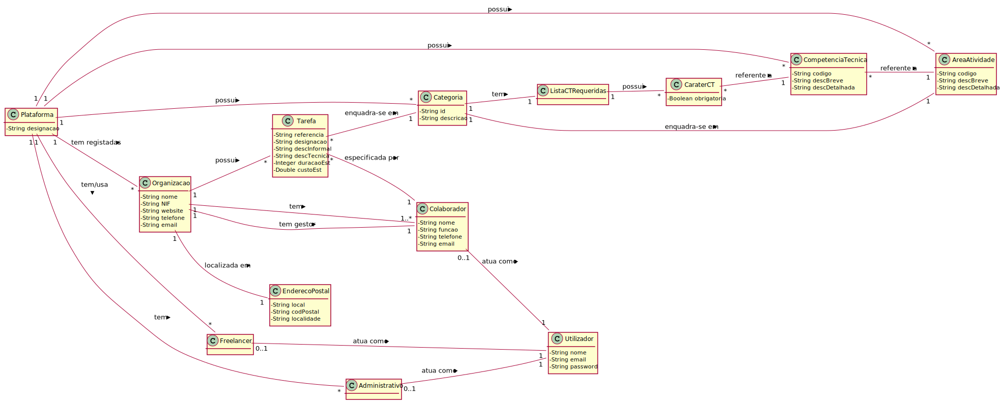
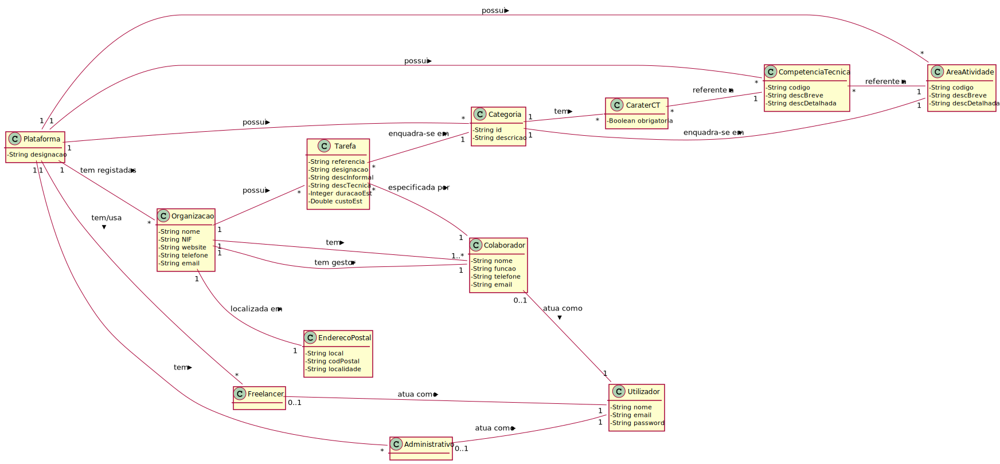
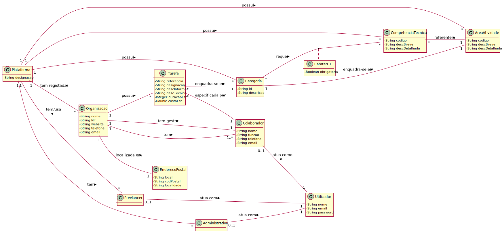
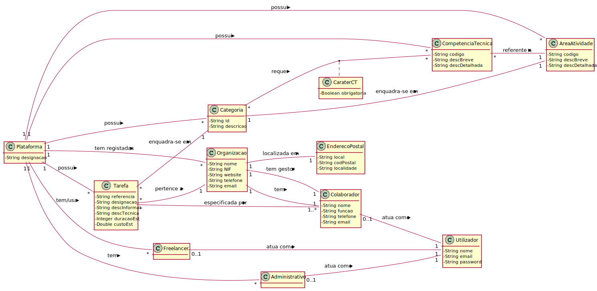

# Análise OO #
O processo de construção do modelo de domínio é baseado nos casos de uso, em especial os substantivos utilizados, e na descrição do enunciado.
## Racional para identificação de classes de domínio ##
Para a identificação de classes de domínio usa-se a lista de categorias das aulas TP (sugeridas no livro). Como resultado temos a seguinte tabela de conceitos (ou classes, mas não de software) por categoria.

### _Lista de Categorias_ ###

**Transações (do negócio)**

*

---

**Linhas de transações**

*

---

**Produtos ou serviços relacionados com transações**

*  Tarefa

---

**Registos (de transações)**

*

---  

**Papéis das pessoas**

* Administrativo
* Freelancer
* Colaborador (de Organização)
* Gestor (de Organização)
* Utilizador
* Utilizador Não Registado

---

**Lugares**

*  Endereço Postal
*  Plataforma

---

**Eventos**

*

---

**Objectos físicos**

*

---

**Especificações e descrições**

*  Área de Atividade
*  Competência Técnica
*  Categoria (de Tarefa)
*  Tarefa

---

**Catálogos**

*

---

**Conjuntos**

* Lista de Competência Técnica Requeridas

---

**Elementos de Conjuntos**

*  Caráter de Competência Técnica Requerida

---

**Organizações**

*  T4J (Plataforma)
*  Organização

---

**Outros sistemas (externos)**

*  (Componente Gestão Utilizadores)

---

**Registos (financeiros), de trabalho, contractos, documentos legais**

*

---

**Instrumentos financeiros**

*

---

**Documentos referidos/para executar as tarefas/**

*

---

## **Racional sobre identificação de associações entre classes** ##

Uma associação é uma relação entre instâncias de objetos que indica uma conexão relevante e que vale a pena recordar, ou é derivável da Lista de Associações Comuns:

+ A é fisicamente (ou logicamente) parte de B
+ A está fisicamente (ou logicamente) contido em B
+ A é uma descrição de B
+ A é conhecido/capturado/registado por B
+ A usa ou gere B
+ A está relacionado com uma transação de B
+ etc.

| Conceito (A) 		|  Associação   		|  Conceito (B) |
|----------	   		|:-------------:		|------:       |
| Administrativo  	| define    		 	| Área de Atividade  |
|   					| define            | Competência Técnica  |
|   					| trabalha para     | Plataforma  |
|						| atua como			| Utilizador |
| Plataforma			| tem registadas    | Organização  |
|						| tem/usa    			| Freelancer  |
|						| tem     			| Administrativo  |
| 						| possui     			| Competência Técnica  |
| 						| possui     			| Área de Atividade  |
| 						| possui     			| Categoria (de Tarefa)  |
| Competência Técnica| referente a       | Área de Atividade  |
| Categoria (de Tarefa)| enquadra-se em | Área de Atividade  |
|						| tem 					| Lista de Competência Técnica Requeridas
| Lista de Competência Técnica Requeridas | tem | Caráter de Competência Técnica Requerida
| Caráter de Competência Técnica Requerida |  é referente a | Competência Técnica
| Organização			| localizada em 	   | Endereço Postal  |
|						| tem gestor     	| Colaborador |
|						| tem		     		| Colaborador |
|						| possui		     	| Tarefa |
| Tarefa		    	| enquadra-se	em 		| Categoria |
| Tarefa		    	| especificada por 	| Colaborador |
| Gestor (de Organização)| é um (papel de)| Colaborador |
| Freelancer			| atua como			| Utilizador |
| Colaborador			| atua como			| Utilizador |

## Modelo de Domínio

De seguida apresentam-se várias alternativas, todas elas aceitáveis.

**Nota: os tipos de dados considerados básicos/primitivos (e.g. String, Double, Integer, Boolean) apresentados são meramente indicativos e de caráter opcional.** É ainda de salientar que estes tipos de dados não representam nem pretendem representar qualquer conceito de negócio. Caso contrário, deveriam estar representados como tal, i.e. através de um conceito (i.e. classe conceptual).

### Alternativa 1
Esta alternativa reflete as principais associações identificadas pelo racional anteriormente realizado.
Por simplicidade (e menor relevância), algumas das associações identificadas (e.g. Administrativo define Área de Atividade) não estão representadas.

### Alternativa 2
Esta alternativa é em tudo semelhante à alternativa 1.
Contudo, considerando que a "Lista de Competência Técnica Requeridas" não tem atributos, decidiu-se representar a mesma através de uma associação entre "Categoria" e "CaraterCT".

### Alternativa 3
Mais uma vez, esta alternativa é semelhante à alternativa 2.
Neste caso, recorreu-se à sintaxe de "*_association class_*" do UML para representar e *caracterizar* a associação de muitos para muitos entre "Categoria" e "Competência Técnica".
A classe "CaraterCT" é a classe associativa que *caracteriza* essa associação.

**Esta notação é comummente usada quando se tem necessidade de "dizer algo", i.e. recolher informação adicional, sobre uma associação entre duas classes.**

### Alternativa 4
Esta alternativa, considerou-se que quem possui as "Tarefa" é a "Plataforma".
Neste caso, é necessário que a "Tarefa" conheça/indique a que "Organização" pertence.

### Sumário

Um Modelo de Domínio representa uma visão parcial e aproximada do problema/negócio em mãos.

Pretendeu-se com isto demonstrar que não existe apenas um Modelo de Domínio correto.
Outros podem existir e serem aceitáveis.
Também não se pretendeu ser exaustivo nas possíveis alternativas e, portanto, podem existir ainda outras alternativas aceitáveis.

O importante é que este capture (sem falhas) os principais conceitos e associações existentes entre conceitos.

Salienta-se ainda que se introduziu a notação UML relativa a classes associativas.

Para a atividade de Design adotar-se-á a **alternativa 3**.
