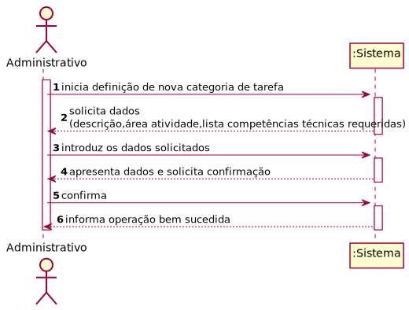
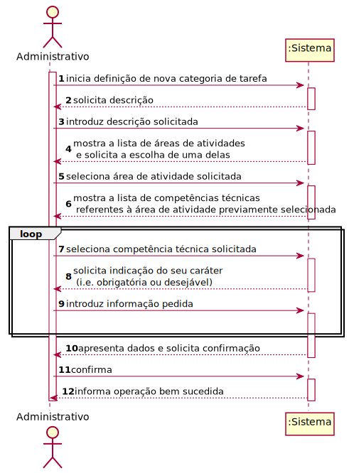
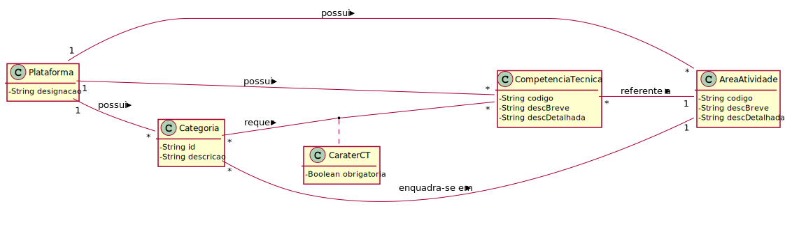
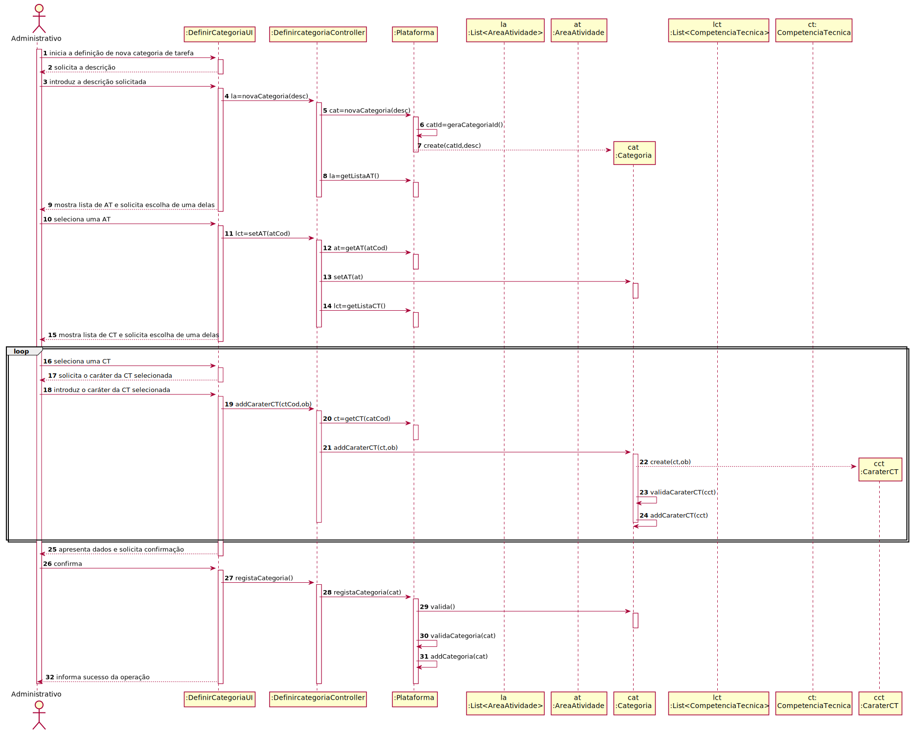
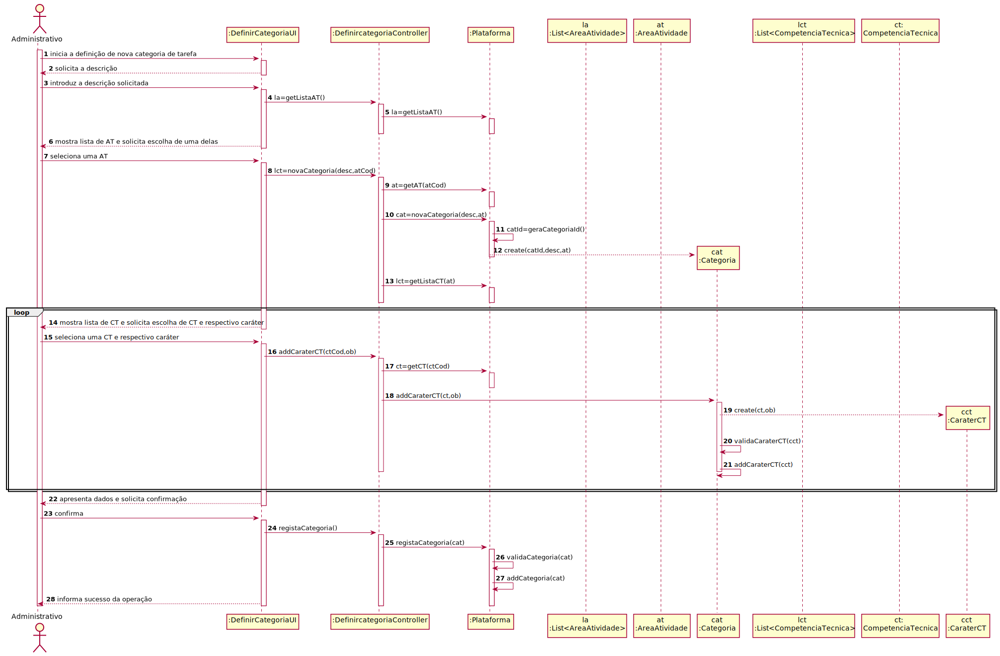
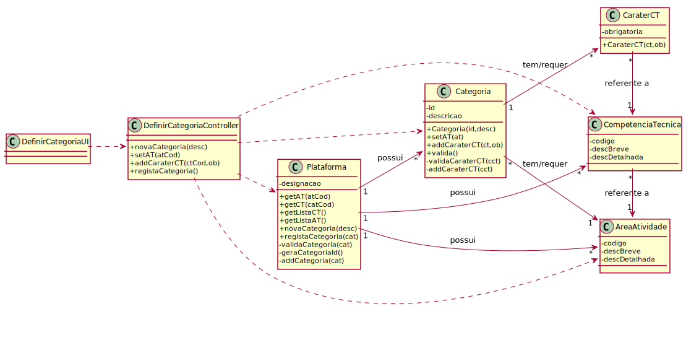

# UC3 - Definir Categoria de Tarefa

## 1. Engenharia de Requisitos

### Formato Breve

O administrativo inicia a definição de uma nova categoria de tarefa. O sistema solicita os dados necessários (i.e. descrição, área de atividade e lista de competências técnicas requeridas). O administrativo introduz os dados solicitados. O sistema valida e apresenta os dados ao administrativo, pedindo que os confirme. O administrativo confirma. O sistema regista os dados e informa o administrativo do sucesso da operação.

### SSD

### Formato Completo

#### Ator principal

Administrativo

#### Partes interessadas e seus interesses
* **Administrativo:** pretende definir as categorias de tarefas para que estas possam ser usadas posteriormente na especificação de tarefas.
* **Colaborador:** pretende que as categorias estejam definidas para poder especificar corretamente as suas tarefas.
* **T4J:** pretende que a plataforma permita associar as categorias de tarefas às áreas de atividades e às tarefas.

#### Pré-condições
n/a

#### Pós-condições
A informação da categoria da tarefa é registada no sistema.

### Cenário de sucesso principal (ou fluxo básico)

1. O administrativo inicia a definição de uma nova categoria de tarefa.
2. O sistema solicita a descrição.
3. O administrativo introduz a descrição.
4. O sistema mostra a lista de áreas de atividades para que seja selecionada uma.
5. O administrativo seleciona uma área de atividade.
6. O sistema mostra a **lista de competências técnicas referentes à área de atividade previamente selecionada** para que seja selecionada uma.
7. O administrativo escolhe uma competência técnica da lista.
8. O sistema solicita indicação do seu caráter (i.e. obrigatória ou desejável).
9. O administrativo introduz informação relativa ao caráter da competência técnica.
10. **Os passos 7 a 9 repetem-se enquanto não forem introduzidas todas as competências técnicas pretendidas.**
11. O sistema valida e apresenta os dados ao administrativo, pedindo que os confirme.
12. O administrativo confirma.
13. O sistema regista os dados e informa o administrativo do sucesso da operação.

#### Extensões (ou fluxos alternativos)

*a. O administrativo solicita o cancelamento da definição da categoria de tarefa.

> O caso de uso termina.

4a. O sistema deteta que a lista de áreas de atividades está vazia.
>1. O sistema informa o administrativo de tal facto.  
>2. O sistema permite a definição de uma nova área de atividade (UC2).  
> 2a. O administrativo não define uma área de atividade. O caso de uso termina.

5a. O administrativo não encontra a área de atividade pretendida.
>1. O administrativo informa o sistema de tal facto.  
>2. O sistema permite a definição de uma nova área de atividade (UC2).  
> 2a. O administrativo não define uma área de atividade. O caso de uso termina.

6a. O sistema deteta que a lista de competências técnicas está vazia.
>1. O sistema informa o administrativo de tal facto.  
>2. O sistema permite a especificação de uma nova competência técnica (UC4).  
> 2a. O administrativo não especifica uma competência técnica. O caso de uso termina.

7a. O administrativo não encontra a competência técnica pretendida.
>1. O administrativo informa o sistema de tal facto.  
>2. O sistema permite a especificação de uma nova competência técnica (UC4).  
> 2a. O administrativo não especifica uma competência técnica. O caso de uso termina.

11a. Dados mínimos obrigatórios em falta.
>	1. O sistema informa quais os dados em falta.
>	2. O sistema permite a introdução dos dados em falta (passo 3).
>
	>	2a. O administrativo não altera os dados. O caso de uso termina.

11b. O sistema deteta que os dados (ou algum subconjunto dos dados) introduzidos devem ser únicos e que já existem no sistema.
>	1. O sistema alerta o administrativo para o facto.
>	2. O sistema permite a sua alteração (passo 3).
>
	>	2a. O administrativo não altera os dados. O caso de uso termina.

11c. O sistema deteta que os dados introduzidos (ou algum subconjunto dos dados) são inválidos.
> 1. O sistema alerta o administrativo para o facto.
> 2. O sistema permite a sua alteração (passo 3).
>
	> 2a. O administrativo não altera os dados. O caso de uso termina.

#### Requisitos especiais
\-

#### Lista de Variações de Tecnologias e Dados
\-

#### Frequência de Ocorrência
\-

#### Questões em aberto

* O identificador da categoria de tarefa tem que obedecer a alguma regra (e.g. ser sequencial)?
* Existem outros dados que são necessários?
* Todos os dados são obrigatórios?
* Qual o número de competências técnicas que no mínimo são obrigatórias para as categorias?
* Qual a frequência de ocorrência deste caso de uso?

### SSD ( referente ao formato completo - cenário principal)

**Nota:** não foi solicitada a realização deste artefacto. A apresentação do mesmo serve apenas para demonstrar que também se pode realizar o SSD no âmbito do formato completo dos casos de uso. Este SSD reflete apenas o cenário principal de sucesso. Contudo, poder-se-ia fazer também para outros cenários.

## 2. Análise OO

### Excerto do Modelo de Domínio Relevante para o UC

## 3. Design - Realização do Caso de Uso

### Racional

| Fluxo Principal | Questão: Que Classe... | Resposta  | Justificação  |
|:--------------  |:---------------------- |:----------|:---------------------------- |
| 1. O administrativo inicia a definição de uma nova categoria de tarefa.   		 |	... interage com o utilizador? | DefinirCategoriaUI    |  Pure Fabrication, pois não se justifica atribuir esta responsabilidade a nenhuma classe existente no Modelo de Domínio. |
|  		 |	... coordena o UC?	| DefinirCategoriaController | Controller    |
|  		 |	... cria instância de Categoria?| Plataforma   | Creator (Regra1)   |
||...gera o identificador único da Categoria?|Plataforma|IE: no MD a Plataforma tem e, portanto, conhece todas as Categorias.|
| 2. O sistema solicita a descrição.  		 |							 |             |                              |
| 3. O administrativo introduz a descrição.  		 |	... guarda os dados introduzidos?  |   Categoria | Information Expert (IE) - instância criada no passo 1.     |
| 4. O sistema mostra a lista de áreas de atividade para que seja selecionada uma. 		 |	...conhece as áreas de atividades?					 |  Plataforma           | IE: A Plataforma agrega/contém AreaAtividade.                           |
| 5. O administrativo seleciona uma área de atividade.  |... guarda a área selecionada? |Categoria   | IE: instância criada no passo 1. No MD uma Categoria é referente a uma AreaAtividade.                             |
| 6. O sistema mostra a lista de competências técnicas referentes à área de atividade previamente selecionada para que seja selecionada uma.		 |	.. conhece as competências técnicas?						 |  Plataforma           | IE: A Plataforma agrega/contém CompetenciaTecnica. Técnicas                            |
||...sabe a que área de atividade a competência técnica se refere?| CompetenciaTecnica |IE: cada CompetenciaTecnica conhece a AreaAtividade em que se enquadra.|
|7. O administrativo escolhe uma competência técnica da lista.  		 |	... guarda a competência técnica selecionada?   | CaraterCT       | IE: no MD cada Categoria tem várias CaraterCT sendo cada uma referente a uma CompetenciaTecnica (CT).    |
||...cria instância de CaracterCT|Categoria|IE: no MD cada Categoria tem várias CaraterCT.|
| 8. O sistema solicita indicação do seu caráter (i.e. obrigatória ou desejável).		 |							 |             |                              |
| 9. O administrativo introduz informação relativa ao caráter da competência técnica.  		 |... guarda a informação introduzida?   | CaraterCT  | IE. instância criada no passo 7.     |
| 10. Os passos 7 a 9 repetem-se enquanto não forem introduzidas todas as competências técnicas pretendidas.||||                          
| 11. O sistema valida e apresenta os dados ao administrativo, pedindo que os confirme.  |	...valida os dados da Categoria (validação local) | Categoria |  IE. A Categoria possui os seus próprios dados.|  	
|	 |	...valida os dados da Categoria (validação global) | Plataforma  | IE: A Plataforma possui/agrega Categoria.  |
| 12. O administrativo confirma.   		 |							 |             |                              |
| 13. O sistema regista os dados e informa o administrativo do sucesso da operação.  		 |	... guarda a Categoria de tarefa criada? | Plataforma  | IE: No MD a Plataforma possui Categoria (de tarefa). |  

### Sistematização ##

 Do racional resulta que as classes conceptuais promovidas a classes de software são:

 * Plataforma
 * Categoria
 * CaraterCT
 * CompetenciaTecnica

Outras classes de software (i.e. Pure Fabrication) identificadas:  

 * DefinirCategoriaUI  
 * DefinirCategoriaController

###	Diagrama de Sequência
###	Versão 1
Esta versão segue todos os passos do cenário principal de sucesso e considera que para criar um objeto "Categoria" são suficientes os atributos código e descrição.

###	Versão 2

Neste versão considera-se que para criar um objeto "Categoria" são necessários os atributos código e descrição bem como a **área de atividade** em que a mesma se enquadra. Isto conduziu a que a instânciação (i.e. create) de "Categoria" fosse realizada mais tarde.

Adicionalmente, decidiu-se juntar apenas numa interação os passos 7 e 9 do cenário principal de sucesso (cf. mensagem 15). Note-se que na versão 1 estes dois passos estavam representados na mensagem 16 e 18.

###	Diagrama de Classes

Em conformidade com a versão 1 do diagrama de sequência.

