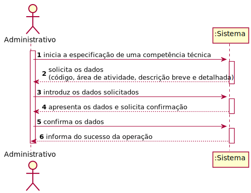
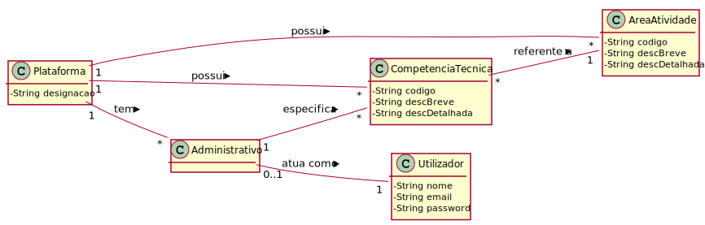
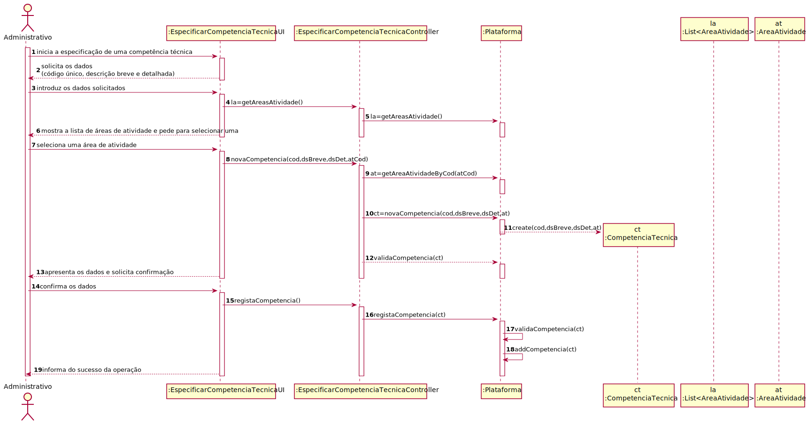
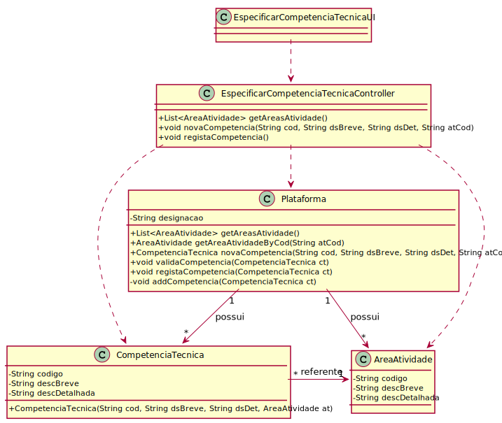
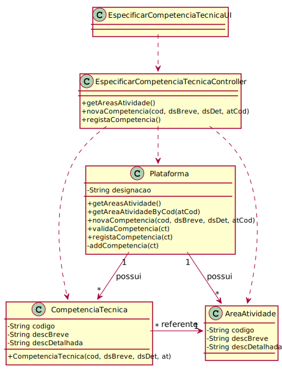

# UC4 - Especificar Competência Técnica

## 1. Engenharia de Requisitos

### Formato Breve

O administrativo inicia a especificação de uma competência técnica. O sistema solicita os dados necessários (i.e. código **único**, área de atividade e descrição breve e detalhada). O administrativo introduz os dados solicitados. O sistema **valida** e apresenta os dados ao administrativo, pedindo que os confirme. O administrativo confirma os dados. O sistema **regista os dados** e informa o administrativo do sucesso da operação.

### SSD

### Formato Completo

#### Ator principal

* Administrativo

#### Partes interessadas e seus interesses
* **Administrativo:** pretende especificar as competências técnicas requeridas para a realização de tarefas.
* **Freelancer:** pretende conhecer as competências técnicas que podem ser requeridas para a realização de tarefas.
* **Organização:** pretende contratar pessoas com as competências técnicas requeridas para a realização de tarefas.
* **T4J:** pretende que as competências técnicas estejam descritas com rigor/detalhe.

#### Pré-condições
* n/a

#### Pós-condições
* A informação da nova competência técnica é registada no sistema.

### Cenário de sucesso principal (ou fluxo básico)

1. O administrativo inicia a especificação de uma competência técnica.
2. O sistema solicita os dados necessários (i.e. código único, descrição breve e detalhada).
3. O administrativo introduz os dados solicitados.
4. **O sistema mostra a lista de áreas de atividade e pede ao administrativo para selecionar uma.**
5. **O administrador seleciona uma área de atividade.**
6. O sistema valida e apresenta os dados ao administrativo, pedindo que os confirme.
7. O administrativo confirma os dados.
8. O sistema regista os dados e informa o administrativo do sucesso da operação.

#### Extensões (ou fluxos alternativos)

*a. O administrativo solicita o cancelamento da especificação da competência técnica.  
> O caso de uso termina.

4a. Não existem áreas de atividade definidas no sistema.  
>1. O sistema informa o administrativo de tal facto.  
>2. O sistema permite a criação de uma nova área de atividade (UC2).  
> 2a. O administrativo não cria uma área de atividade. O caso de uso termina.

6a. Dados mínimos obrigatórios em falta.
>	1. O sistema informa quais os dados em falta.
>	2. O sistema permite a introdução dos dados em falta (passo 3).  
> 2a. O administrativo não introduz os dados em falta. O caso de uso termina.

6b. O sistema deteta que os dados (ou algum subconjunto dos dados) introduzidos devem ser únicos e que já existem no sistema.
>	1. O sistema alerta o administrativo para o facto.
>	2. O sistema permite a sua alteração (passo 3).  
> 2a. O administrativo não altera os dados. O caso de uso termina.

6c. O sistema deteta que os dados introduzidos (ou algum subconjunto dos dados) são inválidos.
> 1. O sistema alerta o administrativo para o facto.
> 2. O sistema permite a sua alteração (passo 3)..  
> 2a. O administrativo não altera os dados. O caso de uso termina.

#### Requisitos especiais
\-

#### Lista de Variações de Tecnologias e Dados
\-

#### Frequência de Ocorrência
\-

#### Questões em aberto

* Existem outros dados que são necessários?
* Todos os dados são obrigatórios?
* O código único é sempre introduzido pelo administrativo ou o sistema deve gerá-lo automaticamente?
* Para além de ser único, o código tem mais alguma restrição?
* Qual a frequência de ocorrência deste caso de uso?

## 2. Análise OO

### Excerto do Modelo de Domínio Relevante para o UC

## 3. Design - Realização do Caso de Uso

### Racional

| Fluxo Principal | Questão: Que Classe... | Resposta  | Justificação  |
|:--------------  |:---------------------- |:----------|:---------------------------- |
| 1. O administrativo inicia a especificação de uma competência técnica.  |	... interage com o utilizador? | EspecificarCompetenciaTecnicaUI |  Pure Fabrication: não se justifica atribuir esta responsabilidade a nenhuma classe existente no Modelo de Domínio. |
|  		 |	... coordena o UC?	| EspecificarCompetenciaTecnicaController | Controller    |
|  		 |	... cria instância de CompetenciaTecnica? | Plataforma   | Creator (Regra1): no MD a Plataforma possui CompetenciaTecnica.  |
| 2. O sistema solicita os dados necessários (i.e. código único, descrição breve e detalhada).  		 |							 |             |                              |
| 3. O administrativo introduz os dados solicitados.  		 |	... guarda os dados introduzidos?  |   CompetenciaTecnica | Information Expert (IE)-instância criada no passo 1: possui os seus próprios dados.     |
| 4. O sistema mostra a lista de áreas de atividade e pede ao administrativo para selecionar uma.  		 |	... conhece a lista de áreas de atividade?  |  Plataforma  | IE: no MD a Plataforma possui todas as instâncias de AreaAtividade.                             |
| 5. O administrador seleciona uma área de atividade. | ... guarda a área de atividade selecionada?	| CompetenciaTecnica | IE: possui os próprios dados - no MD a CompetenciaTecnica é referente a uma AreaAtividade.                              |
| 6. O sistema valida e apresenta os dados ao administrativo, pedindo que os confirme.   		 |	... valida os dados da CompetenciaTecnica (validação local)? | CompetenciaTecnica | IE: possui os seus próprios dados.|  	
|	 |	... valida os dados da CompetenciaTecnica (validação global)? | Plataforma  | IE: a Plataforma contém/agrega CompetenciaTecnica.  |
| 7. O administrativo confirma os dados.   		 |							 |             |                              |
| 8. O sistema regista os dados e informa o administrativo do sucesso da operação.  		 |	... guarda a CompetenciaTecnica criada? | Plataforma  | IE: a Plataforma contém/agrega CompetenciaTecnica. |  

### Sistematização ##

 Do racional resulta que as classes conceptuais promovidas a classes de software são:

 * Plataforma
 * CompetenciaTecnica

Outras classes de software (i.e. Pure Fabrication) identificadas:  

 * EspecificarCompetenciaTecnicaUI  
 * EspecificarCompetenciaTecnicaController

###	Diagrama de Sequência

###	Diagrama de Classes

Apresentam-se duas versões do diagrama de classes:

1. A primeira é **mais completa e rigorosa** no sentido em que apresenta os tipos de dados dos parâmetros de entrada de cada método bem como o tipo de dados do valor retornado por esse mesmo método.
2. A segunda é semelhante à anterior. Contudo, por simplificação, esta não apresenta os tipos de dados dos parâmetros de entrada nem do valor retornado por cada método.

Algumas ferramentas de modelação (e.g. Visual Paradigm) têm a capacidade de gerar código a partir dos modelos. Para tal, necessitam que os diagramas de classes (e de sequência) estejam definidos de forma completa e rigorosa.

#### Versão Mais Completa e Rigorosa

#### Versão Simplificada

