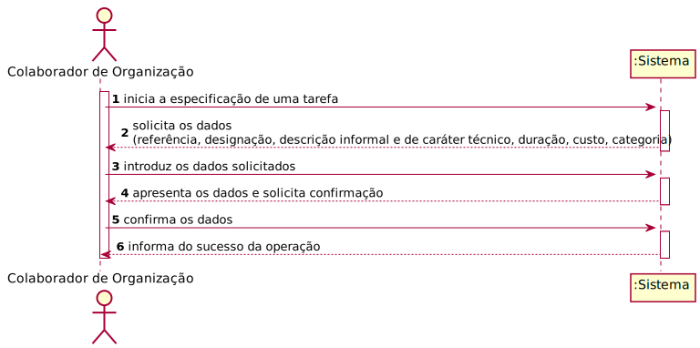
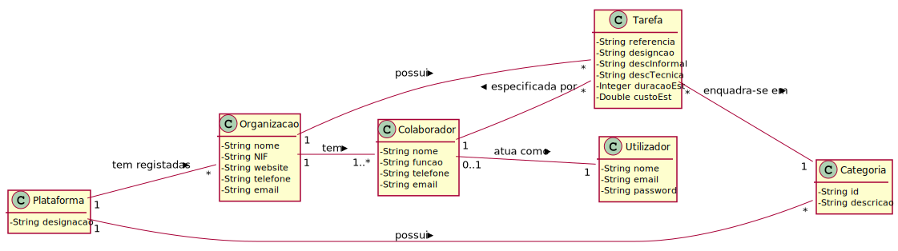
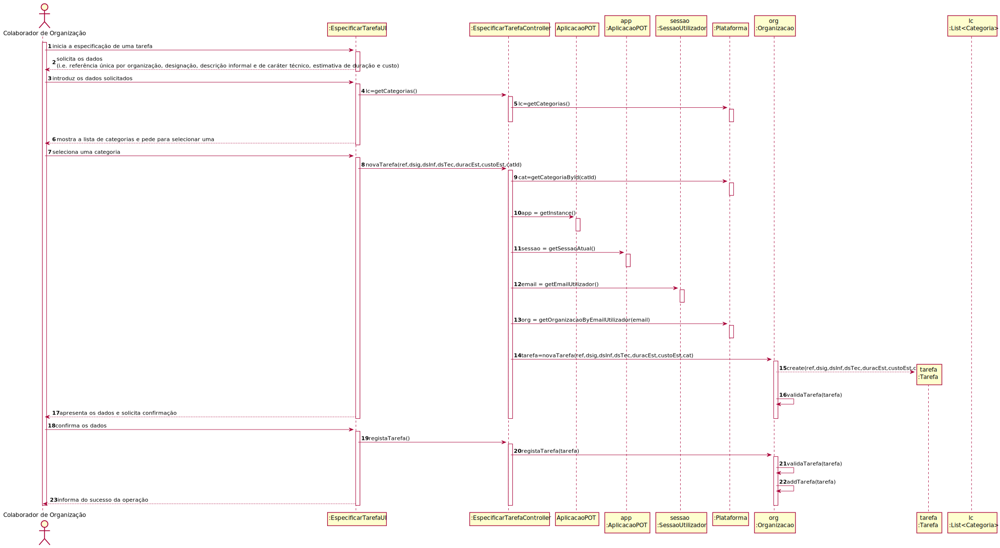
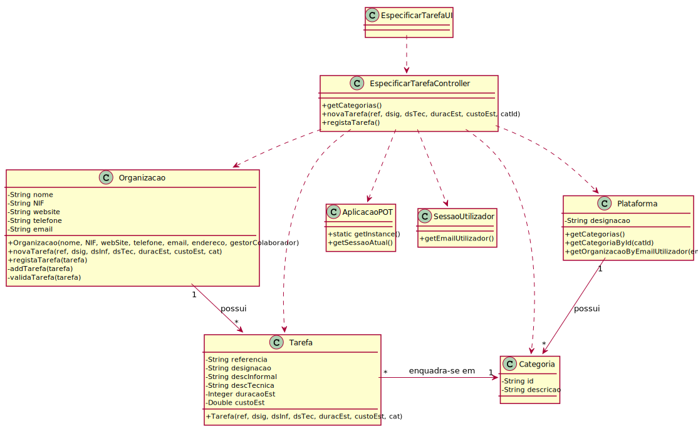

# UC6 - Especificar Tarefa

## 1. Engenharia de Requisitos

### Formato Breve

O colaborador de organização inicia a especificação de uma tarefa. O sistema solicita os dados necessários (i.e. uma referência única por organização, uma designação, uma descrição informal e outra de carácter técnico, uma estimativa de duração e custo, a categoria). O colaborador de organização introduz os dados solicitados. O sistema **valida** e apresenta os dados ao colaborador de organização, pedindo que os confirme. O colaborador de organização confirma. O sistema **regista os dados** e informa o colaborador de organização do sucesso da operação.

### SSD

### Formato Completo

#### Ator principal

* Colaborador de Organização

#### Partes interessadas e seus interesses
* **Colaborador de Organização:** pretende especificar tarefas.
* **Organização:** pretende que os seus colaboradores possam especificar tarefas para posterior publicação.
* **Freelancer:** pretende conhecer as tarefas a que pode candidatar-se.
* **T4J:** pretende a adjudicação de tarefas a freelancers.

#### Pré-condições
* Tem que existir categorias de tarefas definidas no sistema.

#### Pós-condições
* A informação da nova tarefa é registada no sistema.

### Cenário de sucesso principal (ou fluxo básico)

1. O colaborador de organização inicia a especificação de uma tarefa.
2. O sistema solicita dados necessários (i.e. referência única por organização, designação, descrição informal e de caráter técnico, estimativa de duração e custo).
3. O colaborador de organização introduz os dados solicitados.
4. **O sistema mostra a lista de categorias existentes e pede ao colaborador para selecionar uma.**
5. **O colaborador seleciona a categoria em que a tarefa se enquadra.**
6. O sistema valida e apresenta os dados ao colaborador de organização, pedindo que os confirme.
7. O colaborador de organização confirma os dados.
8. O sistema regista os dados e informa o colaborador de organização do sucesso da operação.

#### Extensões (ou fluxos alternativos)

*a. O colaborador de organização solicita o cancelamento da especificação de tarefa.

> O caso de uso termina.

5a. A categoria pretendida não está definida no sistema.
>	1. O colaborador informa o sistema de tal facto. O caso de uso termina.

6a. Dados mínimos obrigatórios em falta.
>	1. O sistema informa quais os dados em falta.
>	2. O sistema permite a introdução dos dados em falta (passo 3)
>
	>	2a. O colaborador de organização não altera os dados. O caso de uso termina.

6b. O sistema deteta que os dados (ou algum subconjunto dos dados) introduzidos devem ser únicos e que já existem no sistema.
>	1. O sistema alerta o colaborador de organização para o facto.
>	2. O sistema permite a sua alteração (passo 3)
>
	>	2a. O colaborador de organização não altera os dados. O caso de uso termina.

6c. O sistema deteta que os dados introduzidos (ou algum subconjunto dos dados) são inválidos.
> 1. O sistema alerta o colaborador de organização para o facto.
> 2. O sistema permite a sua alteração (passo 3).
>
	> 2a. O colaborador de organização não altera os dados. O caso de uso termina.

#### Requisitos especiais
\-

#### Lista de Variações de Tecnologias e Dados
\-

#### Frequência de Ocorrência
\-

#### Questões em aberto

* Existem outros dados que são necessários?
* Todos os dados são obrigatórios?
* Quando a categoria pretendida não existe, é necessário recolher alguma informação ou notificar alguém que isso aconteceu?
* A lista de categorias pode ser extensa. Faz sentido permitir filtros (e.g. por área de atividade) e/ou pesquisa (e.g. pela descrição)?
* Quais as unidades de medida usadas na estimativa de duração e custo?
* Qual a frequência de ocorrência deste caso de uso?

## 2. Análise OO

### Excerto do Modelo de Domínio Relevante para o UC

## 3. Design - Realização do Caso de Uso

### Racional

| Fluxo Principal | Questão: Que Classe... | Resposta  | Justificação  |
|:--------------  |:---------------------- |:----------|:---------------------------- |
| 1. O colaborador de organização inicia a especificação de uma tarefa.  |	... interage com o utilizador? | EspecificarTarefaUI |  Pure Fabrication: não se justifica atribuir esta responsabilidade a nenhuma classe existente no Modelo de Domínio. |
|  		 |	... coordena o UC?	| EspecificarTarefaController | Controller    |
|  		 |	... cria instância de Tarefa? | Organizacao | Creator (Regra1): no MD a Organizacao possui Tarefa.   |
||...conhece o utilizador/gestor a usar o sistema?|SessaoUtilizador|IE: cf. documentação do componente de gestão de utilizadores.|
||...sabe a que organização o utilizador/colaborador pertence?|Plataforma|IE: conhece todas as organizações.|
|||Organização|IE: conhece os seus colaboradores.|
|||Colaborador|IE: conhece os seus dados (e.g. email). |
| 2. O sistema solicita os dados necessários (i.e. referência única por organização, designação, descrição informal e de caráter técnico, estimativa de duração e custo).  		 |							 |             |                              |
| 3. O colaborador de organização introduz os dados solicitados.  		 |	... guarda os dados introduzidos?  |   Tarefa | Information Expert (IE)-instância criada no passo 1: possui os seus próprios dados.     |
| 4. O sistema mostra a lista de categorias e pede ao colaborador de organização para selecionar uma.  		 |	... conhece a lista de categorias?  |  Plataforma  | IE: no MD a Plataforma possui todas as instâncias de Categoria.                             |
| 5. O colaborador seleciona a categoria em que a tarefa se enquadra. | ... guarda a categoria selecionada?	| Tarefa | IE: possui os próprios dados - no MD a Tarefa enquadra-se numa Categoria.                              |
| 6. O sistema valida e apresenta os dados ao colaborador de organização, pedindo que os confirme.   		 |	... valida os dados da Tarefa (validação local)? | Tarefa |              IE: possui os seus próprios dados.|  	
|	 |	... valida os dados da Tarefa (validação global)? | Organizacao  | IE: a Organizacao contém/agrega Tarefa.  |
| 7. O colaborador de organização confirma os dados.   		 |							 |             |                              |
| 8. O sistema regista os dados e informa o colaborador de organização do sucesso da operação.  		 |	... guarda a Tarefa criada? | Organizacao  | IE: a Organizacao contém/agrega Tarefa. |

### Sistematização ##

 Do racional resulta que as classes conceptuais promovidas a classes de software são:

 * Organizacao
 * Plataforma
 * Tarefa

Outras classes de software (i.e. Pure Fabrication) identificadas:  

 * EspecificarTarefaUI  
 * EspecificarTarefaController

Outras classes de sistemas/componentes externos:

 * SessaoUtilizador

###	Diagrama de Sequência

**Nota 1:** As mensagens 10, 11 e 12 têm o intuito de demonstrar como é obtida a informação do utilizador do sistema e estão em conformidade a documentação fornecida inicialmente. Nesse sentido, podiam ter sido omitidas.

**Nota 2:** __Neste UC, a mensagem 13 é de extrema relevância pois é com esta que se determina em que organização se regista a tarefa que está a ser criada.__

###	Diagrama de Classes

