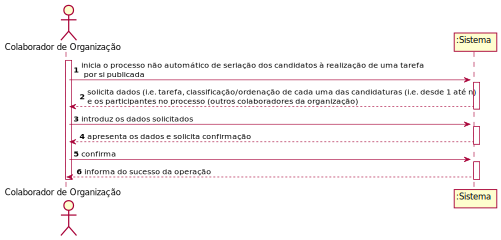
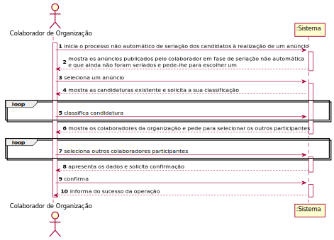
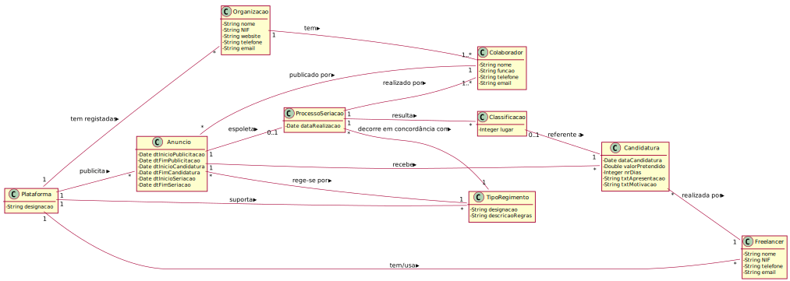
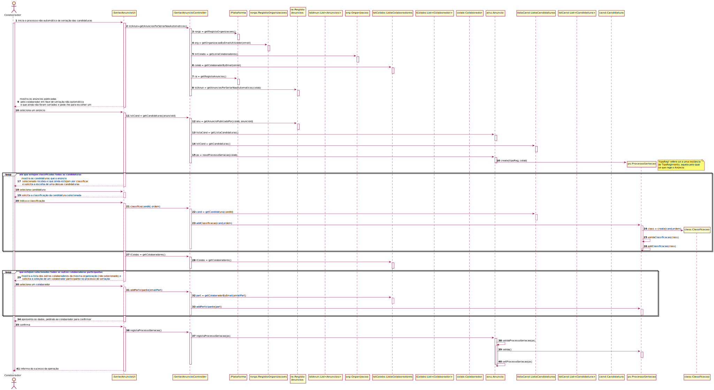
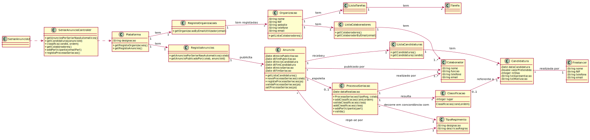

# UC 10 - Seriar (Não Automaticamente) Candidaturas de Anúncio

## 1. Engenharia de Requisitos

### Formato Breve

O colaborador de organização inicia o processo não automático de seriação dos candidatos à realização de um anúncio por si publicado. O sistema solicita dados (i.e. o anúncio, a classificação de cada uma das candidaturas e os outros colaboradores da organização participantes no processo). O colaborador introduz os dados solicitados. O sistema valida e apresenta os dados, pedindo que os confirme. O colaborador confirma. O sistema regista os dados juntamente com a data/hora atual e informa o colaborador do sucesso da operação.

### SSD

### Formato Breve - Outra Alternativa

O colaborador de organização inicia o processo não automático de seriação dos candidatos à realização de um anúncio. O sistema mostra os anúncios publicados pelo colaborador em fase de seriação não automática e que ainda não foram seriadas e pede-lhe para escolher um. O colaborador seleciona um anúncio. O sistema mostra as candidaturas existente e solicita a sua classificação. O colaborador classifica as candidaturas. O sistema mostra os colaboradores da organização e pede para selecionar os outros participantes no processo. O colaborador seleciona. O sistema valida e apresenta os dados, pedindo que os confirme. O colaborador confirma. O sistema regista os dados juntamente com a data/hora atual e informa o colaborador do sucesso da operação.

### Formato Completo

#### Ator principal

* Colaborador de Organização

#### Partes interessadas e seus interesses

* **Colaborador de Organização:** pretende seriar as candidaturas que um anúncio recebeu.
* **Freelancer:** pretende conhecer a classificação das suas candidaturas à realização de determinados anúncios publicados na plataforma.
* **Organização:** pretende contratar pessoas externas (outsourcing) para a realização de determinadas tarefas e com competências técnicas apropriadas.
* **T4J:** pretende satisfazer as organizações e os freelancer facilitando a contratação de freelancers pelas organizações e vice-versa.

#### Pré-condições

* Existir pelo menos um anúncio de tarefa em condições de ser seriado manualmente pelo colaborador ativo no sistema.

#### Pós-condições
* A informação do processo de seriação é registada no sistema.

#### Cenário de sucesso principal (ou fluxo básico)

1. O colaborador inicia o processo não automático de seriação das candidaturas a um anúncio.
2. O sistema mostra os anúncios publicadas pelo colaborador em fase de seriação não automática e que ainda não foram seriados e pede-lhe para escolher um.
3. O colaborador seleciona um anúncio.
4. O sistema mostra as candidaturas que o anúncio selecionado recebeu e que ainda estejam por classificar e solicita a escolha de uma dessas candidaturas.
5. O colaborador seleciona uma candidatura.
6. O sistema solicita a classificação da candidatura selecionada.
7. O colaborador indica a classificação.
8. Os passos 4 a 7 repetem-se até que estejam classificadas todas as candidaturas.
9. O sistema mostra a lista dos outros colaboradores da mesma organização (não selecionado) e solicita a seleção de um colaborador participante no processo de seriação.
10. O colaborador seleciona um colaborador.
11. Os passos 9 e 10 repetem-se até que estejam selecionados todos os outros colaboradores participantes no processo de seriação.
12. O sistema valida e apresenta os dados, pedindo ao colaborador para confirmar.
13. O colaborador confirma.
14. O sistema regista os dados juntamente com a data/hora atual e informa o colaborador do sucesso da operação.

#### Extensões (ou fluxos alternativos)

*a. O colaborador solicita o cancelamento do processo de seriação das candidaturas.
> O caso de uso termina.

12a. Dados mínimos obrigatórios em falta.
>	1. O sistema informa quais os dados em falta.
>	2. O sistema permite a introdução dos dados em falta (passo 2)
>
	> 2a. O colaborador não altera os dados. O caso de uso termina.

#### Requisitos especiais

\-

#### Lista de Variações de Tecnologias e Dados

\-

#### Frequência de Ocorrência

\-

#### Questões em aberto

* O mesmo lugar/classificação pode ser atribuído a mais do que uma candidatura (e.g. em caso de empate)?
* O processo de seriação pode ser concluído havendo candidaturas por classificar?
* Há algum motivo que possa levar à desclassificação de uma candidatura? 

## 2. Análise OO

### Excerto do Modelo de Domínio Relevante para o UC

## 3. Design - Realização do Caso de Uso

### Racional

**(omitido)**

### Sistematização ##

 Do racional resulta que as classes conceptuais promovidas a classes de software são:

 * Plataforma
 * Anuncio
 * Candidatura
 * ProcessoSeriacao
 * TipoRegimento
 * Classificacao
 * Organizacao
 * Colaborador

Outras classes de software (i.e. Pure Fabrication) identificadas:  

 * SeriarAnuncioUI  
 * SeriarAnuncioController
 * RegistoAnuncios
 * RegistoOrganizacoes
 * ListaColaboradores
 * ListaCandidaturas

###	Diagrama de Sequência

###	Diagrama de Classes

**Nota:** Algumas dependências estão omitidas.