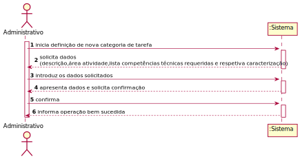
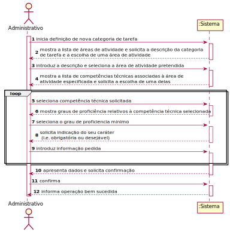
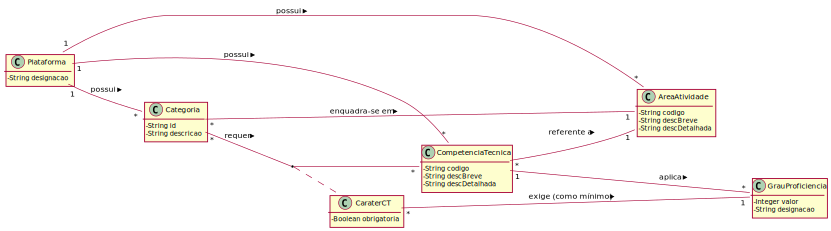
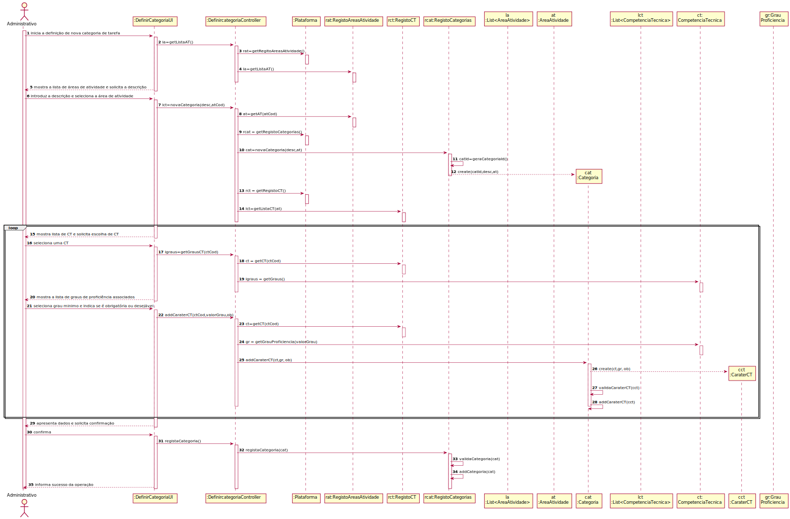
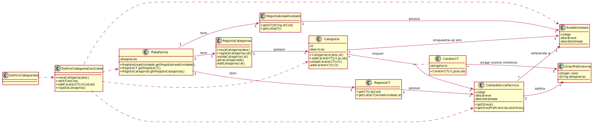

# UC3 - Definir Categoria de Tarefa

## 1. Engenharia de Requisitos

### Formato Breve

O administrativo inicia a definição de uma nova categoria de tarefa. O sistema solicita os dados necessários (i.e. descrição, área de atividade e **lista de competências técnicas requeridas e respetiva caracterização**). O administrativo introduz os dados solicitados. O sistema valida e apresenta os dados ao administrativo, pedindo que os confirme. O administrativo confirma. O sistema regista os dados e informa o administrativo do sucesso da operação.

### SSD

### Formato Completo

#### Ator principal

Administrativo

#### Partes interessadas e seus interesses
* **Administrativo:** pretende definir as categorias de tarefas para que estas possam ser usadas posteriormente na especificação de tarefas.
* **Colaborador:** pretende que as categorias estejam definidas para poder especificar corretamente as suas tarefas.
* **T4J:** pretende que a plataforma permita associar as categorias de tarefas às áreas de atividades e às tarefas.

#### Pré-condições
n/a

#### Pós-condições
n/a

### Cenário de sucesso principal (ou fluxo básico)

1. O administrativo inicia a definição de uma nova categoria de tarefa.
2. O sistema mostra a lista de áreas de atividade e solicita a descrição da categoria de tarefa e a escolha de uma área de atividade.
3. O administrativo introduz a descrição e seleciona a área de atividade pretendida.
4. O sistema mostra a lista de competências técnicas associadas à área de atividade especificada e solicita a escolha de uma delas.
5. O administrativo seleciona uma competência técnica.
6. **O sistema mostra a lista de graus de proficiência associados à competência técnica e solicita a escolha de um deles como minimo.**
7. **O administrativo seleciona um grau de proficiência mínimo.**
8. O sistema solicita ainda o caráter da competência técnica selecionada (i.e. obrigatória ou desejável).
9. O administrativo introduz o caráter da competência técnica.
10. O sistema guarda a informação da competência técnica requerida (a competência, o grau e a obrigatoriedade).
11. **Os passos 5 a 10 repetem-se enquanto não forem introduzidas todas as competências técnicas pretendidas.**
12. O sistema valida e apresenta os dados ao administrativo, pedindo que os confirme.
13. O administrativo confirma.
14. O sistema regista os dados e informa o administrativo do sucesso da operação.

#### Extensões (ou fluxos alternativos)

*a. O administrativo solicita o cancelamento da definição da categoria de tarefa.

> O caso de uso termina.

2a. O sistema deteta que a lista de áreas de atividades está vazia.
>1. O sistema informa o administrativo de tal facto.  
>2. O sistema permite a definição de uma nova área de atividade (UC2).  
> 2a. O administrativo não define uma área de atividade. O caso de uso termina.

3a. O administrativo não encontra a área de atividade pretendida.
>1. O administrativo informa o sistema de tal facto.  
>2. O sistema permite a definição de uma nova área de atividade (UC2).  
> 2a. O administrativo não define uma área de atividade. O caso de uso termina.

4a. O sistema deteta que a lista de competências técnicas está vazia.
>1. O sistema informa o administrativo de tal facto.  
>2. O sistema permite a especificação de uma nova competência técnica (UC4).  
> 2a. O administrativo não especifica uma competência técnica. O caso de uso termina.

5a. O administrativo não encontra a competência técnica pretendida.
>1. O administrativo informa o sistema de tal facto.  
>2. O sistema permite a especificação de uma nova competência técnica (UC4).  
> 2a. O administrativo não especifica uma competência técnica. O caso de uso termina.

12a. Dados mínimos obrigatórios em falta.
>	1. O sistema informa quais os dados em falta.
>	2. O sistema permite a introdução dos dados em falta (passo 3).
>
	>	2a. O administrativo não altera os dados. O caso de uso termina.

12b. O sistema deteta que os dados (ou algum subconjunto dos dados) introduzidos devem ser únicos e que já existem no sistema.
>	1. O sistema alerta o administrativo para o facto.
>	2. O sistema permite a sua alteração (passo 3).
>
	>	2a. O administrativo não altera os dados. O caso de uso termina.

12c. O sistema deteta que os dados introduzidos (ou algum subconjunto dos dados) são inválidos.
> 1. O sistema alerta o administrativo para o facto.
> 2. O sistema permite a sua alteração (passo 3).
>
	> 2a. O administrativo não altera os dados. O caso de uso termina.

#### Requisitos especiais
\-

#### Lista de Variações de Tecnologias e Dados
\-

#### Frequência de Ocorrência
\-

#### Questões em aberto

* O identificador da categoria de tarefa tem que obedecer a alguma regra (e.g. ser sequencial)?
* Quais são os critérios para validação de uma categoria de tarefa?

### SSD Formato Completo

## 2. Análise OO

### Excerto do Modelo de Domínio Relevante para o UC

## 3. Design - Realização do Caso de Uso

### Racional

| Fluxo Principal | Questão: Que Classe... | Resposta  | Justificação  |
|:--------------  |:---------------------- |:----------|:---------------------------- |
| 1.  O administrativo inicia a definição de uma nova categoria de tarefa. | ... interage com o utilizador? | DefinirCategoriaUI | Pure Fabrication, pois não se justifica atribuir esta responsabilidade a nenhuma classe existente no Modelo de Domínio. |
|  		 | ... coordena o UC? | DefinirCategoriaController | Controller |
|  		 | ... cria instância de Categoria? | RegistoCategorias | HC/Creator (Regra1) |
||...gera o identificador único da Categoria? | RegistoCategorias | HC/IE: no MD o RegistoCategorias tem e, portanto, conhece todas as Categorias. |
| 2. O sistema mostra a lista de áreas de atividade e solicita a descrição da categoria de tarefa e a escolha de uma área de atividade. | ...conhece as áreas de atividade? | RegistoAreasAtividade | IE/HC |
| 3. O administrativo introduz a descrição e seleciona a área de atividade pretendida. | ... guarda os dados introduzidos? | Categoria | Information Expert (IE) |
| 4. O sistema mostra a lista de competências técnicas associadas à área de atividade especificada e solicita a escolha de uma delas. | ...conhece as competências técnicas? | RegistoCompetenciasTecnicas | IE/HC |
||...sabe a que área de atividade a competência técnica se refere?|CompetenciaTecnica|IE: conhece a sua AreaAtividade|
| 5. O administrativo seleciona uma competência técnica. |... guarda a CT selecionada? |CaraterCT   | IE: no MD cada Categoria tem várias CaraterCT sendo cada uma referente a uma CompetenciaTecnica (CT).                          |
| 6. O sistema mostra a lista de graus de proficiência associados à competência técnica e solicita a escolha de um deles como minimo.		 |	.. conhece os graus de proficiencia?						 |  CompetenciaTecnica           | IE: A CompetenciaTecnica aplica GrauProficiencia                           |
|7.O administrativo seleciona um grau de proficiência mínimo.		 |	... guarda o grau selecionado?   | CaraterCT       | IE. instância criada no passo 5.   |
| 8. O sistema solicita ainda o caráter da competência técnica selecionada (i.e. obrigatória ou desejável).		 |							 |             |                              |
| 9. O administrativo introduz o caráter da competência técnica. 		 |... guarda a informação introduzida?   | CaraterCT  | IE. instância criada no passo 5.     |
|10. O sistema guarda a informação da competência técnica requerida (a competência, o grau e a obrigatoriedade).|...guarda esta informação|Categoria|IE: no MD cada Categoria tem várias CaraterCT.|
| 11. **Os passos 5 a 10 repetem-se enquanto não forem introduzidas todas as competências técnicas pretendidas.**||||                          
| 12. O sistema valida e apresenta os dados ao administrativo, pedindo que os confirme.  |	...valida os dados da Categoria (validação local) | Categoria |  IE. A Categoria possui os seus próprios dados.|  	
|	 |	...valida os dados da Categoria (validação global) | RegistoCategorias  | IE: A Plataforma possui/agrega Categoria.  |
| 13. O administrativo confirma.   		 |							 |             |                              |
| 14. O sistema regista os dados e informa o administrativo do sucesso da operação.  		 |	... guarda a Categoria de tarefa criada? | RegistoCategorias  | IE/HC: RegistoCategorias possui Categoria (de tarefa). |  

### Sistematização ##

 Do racional resulta que as classes conceptuais promovidas a classes de software são:

 * Plataforma
 * Categoria
 * CaraterCT
 * CompetenciaTecnica
 * GrauProficiencia

Outras classes de software (i.e. Pure Fabrication) identificadas:  

 * DefinirCategoriaUI  
 * DefinirCategoriaController
 * RegistoAreaAtividade
 * RegistoCategorias
 * RegistoCompetenciasTecnicas

###	Diagrama de Sequência

**Nota:** Na eventualidade de se considerar que em cada CT presente na lista devolvida nas mensagems 14/15 contem a lista de graus, então as mensagens 17, 18 e 19 não seriam necessárias.
Esta abordagem foi adotada no design do UC 7.

###	Diagrama de Classes

