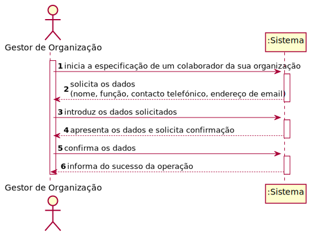
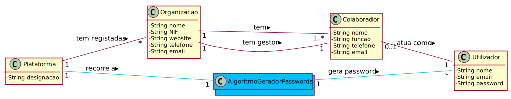
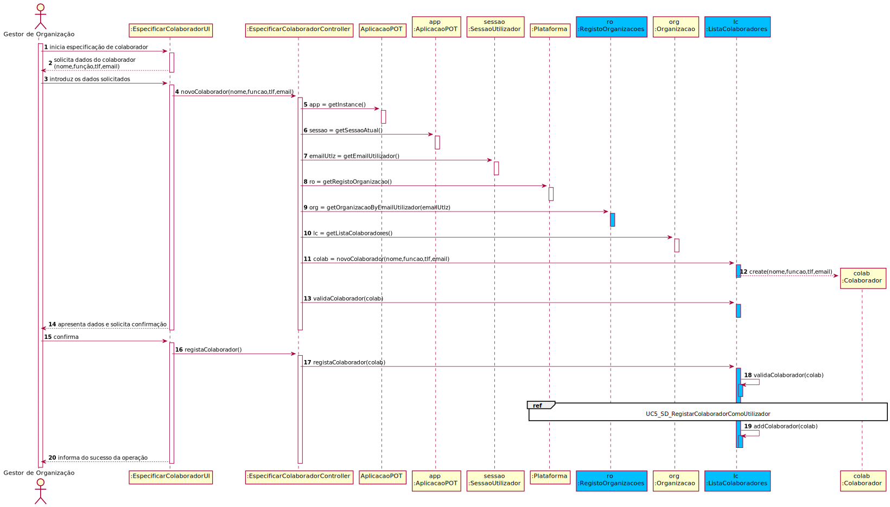
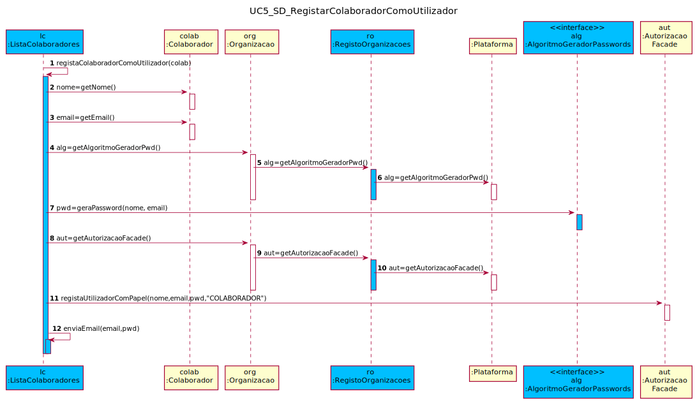
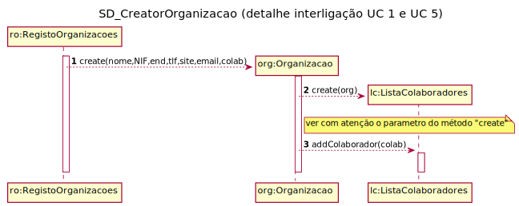
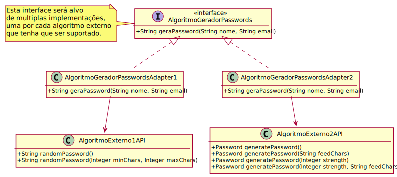

# UC5 - Especificar Colaborador de Organização

## 1. Engenharia de Requisitos

### Formato Breve

O gestor de organização inicia a especificação de um colaborador da sua organização. O sistema solicita os dados necessários (i.e. nome, função, contacto telefónico, endereço de email). O gestor de organização introduz os dados solicitados. O sistema valida e apresenta os dados ao gestor de organização, pedindo que os confirme. O gestor de organização confirma. O sistema regista os dados do colaborador, **gera uma password** para o colaborador, tornando este num utilizador registado, **envia, por email, os dados de acesso ao colaborador** e informa o gestor de organização do sucesso da operação.

### SSD

### Formato Completo

#### Ator principal

* Gestor de Organização

#### Partes interessadas e seus interesses
* **Gestor de Organização:** pretende especificar os colaboradores da sua organização.
* **Organização:** pretende que os seus colaboradores esteja registados para que estes possam atuar em sua representação.
* **T4J:** pretende que as organizações possam registar colaboradores seus.

#### Pré-condições
* n/a

#### Pós-condições
* A informação do novo colaborador de organização é registada no sistema.
* O colaborador também se torna um utilizador registado sistema.
* É enviado um email ao colaborador com a informação de acesso à plataforma.

### Cenário de sucesso principal (ou fluxo básico)

1. O gestor de organização inicia a especificação de um colaborador da sua organização.
2. O sistema solicita os dados necessários (i.e. nome, função, contacto telefónico, endereço de email).
3. O gestor de organização introduz os dados solicitados.
4. O sistema valida e apresenta os dados ao gestor de organização, pedindo que os confirme.
5. O gestor de organização confirma os dados.
6. O sistema regista os dados do colaborador, **gera uma password** para o colaborador, tornando este último num utilizador registado, **envia, por email, os dados de acesso ao colaborador** e informa o gestor de organização do sucesso da operação.

#### Extensões (ou fluxos alternativos)

*a. O gestor de organização solicita o cancelamento da especificação de um colaborador da sua organização.

> O caso de uso termina.

4a. Dados mínimos obrigatórios em falta.
>	1. O sistema informa quais os dados em falta.
>	2. O sistema permite a introdução dos dados em falta (passo 3)
>
	>	2a. O gestor de organização não altera os dados. O caso de uso termina.

4b. O sistema deteta que os dados (ou algum subconjunto dos dados) introduzidos devem ser únicos e que já existem no sistema.
>	1. O sistema alerta o gestor de organização para o facto.
>	2. O sistema permite a sua alteração (passo 3)
>
	>	2a. O gestor de organização não altera os dados. O caso de uso termina.

**4c. O sistema deteta que o email introduzido deve ser único e que já existe no sistema.**
>
>**1. O sistema alerta o gestor de organização para o facto.**
>
> **2. O sistema permite a sua alteração (passo 3).**
>
>>**2a. O gestor de organização não altera os dados. O caso de uso termina.**

**6a. O sistema deteta que o email não foi enviado ao colaborador.**
> **1. O sistema alerta o gestor de organização para o facto.**

>**2. O sistema permite a alteração do email.**
>> **2a. O gestor de organização não altera o email. O caso de uso termina.**

#### Requisitos especiais

* **A password deve ser gerada pela plataforma recorrendo a um algoritmo externo (i.e. concebido por terceiros)**

#### Lista de Variações de Tecnologias e Dados
\-

#### Frequência de Ocorrência
\-

#### Questões em aberto

* Existem outros dados que são necessários?
* Todos os dados são obrigatórios?
* ~~Qual ou quais os dados que identificam de forma única um colaborador de organização~~?
* ~~A palavra-passe do colaborador é gerada automaticamente pelo sistema? Ou deve ser introduzida pelo gestor da organização?~~
* Quais as regras de segurança aplicáveis à palavra-passe?
* ~Qual o processo de notificação da palavra-passe?~~
* Qual a frequência de ocorrência deste caso de uso?

## 2. Análise OO

### Excerto do Modelo de Domínio Relevante para o UC

## 3. Design - Realização do Caso de Uso

### Racional

| Fluxo Principal | Questão: Que Classe... | Resposta  | Justificação  |
|:--------------  |:---------------------- |:----------|:---------------------------- |
| 1. O gestor de organização inicia a especificação de um colaborador da sua organização.   		 |	... interage com o utilizador? | EspecificarColaboradorUI    |  Pure Fabrication: não se justifica atribuir esta responsabilidade a nenhuma classe existente no Modelo de Domínio. |
|  		 |	... coordena o UC?	| EspecificarColaboradorController | Controller    |
|  		 |	... cria instância de Colaborador? | **ListaColaboradores** | **Creator (regra1) + Padrão HC + LC sobre Organizacao: esta delega a responsabilidade na ListaColaboradores.** |
| |**...conhece ListaColaboradores?**| **Organizacao**| **IE: a Organização tem uma ListaColaboradores.** |
||...conhece o utilizador a usar o sistema?|SessaoUtilizador|Information Expert (IE): cf. documentação do componente de gestão de utilizadores.|
||...sabe a que organização o utilizador pertence?|**RegistoOrganizacoes**|**IE: conhece todas as organizações. Padrão HC + LC sobre Plataforma: esta delega a responsabilidade no RegistoOrganizacoes.**|
|||Organização|**IE: Organizacao tem uma ListaColaboradores.** |
|||**ListaColaboradores**| **IE: conhece os colaboradores da organização.** |
| |**...conhece RegistoOrganizacoes?**| **Plataforma**| **IE: a Organização tem uma ListaColaboradores.** |
| 2. O sistema solicita os dados necessários (i.e. nome, função, contacto telefónico, endereço de email).  		 |							 |             |                              |
| 3. O gestor de organização introduz os dados solicitados.  		 |	... guarda os dados introduzidos?  |   Colaborador | IE: instância criada no passo 1; possui os seus próprios dados.     |
| 4. O sistema valida e apresenta os dados ao gestor de organização, pedindo que os confirme.   		 |	... valida os dados do Colaborador (validação local) | Colaborador |  IE: possui os seus próprios dados.|  	
|	 |	... valida os dados do Colaborador (validação global) | **ListaColaboradores**  | **IE: a ListaColaboradores contém/agrega Colaborador.**  |
| 5. O gestor de organização confirma os dados.   		 |							 |             |                              |
| 6. O sistema regista os dados do colaborador, gera a sua password, torna-o um utilizador registado e informa o gestor de organização do sucesso da operação.  		 |	... guarda o Colaborador criado? | **ListaColaboradores**  | **IE: a ListaColaboradores contém/agrega Colaborador.**|  
||**... gera a password do Colaborador?**|**AlgoritmoGeradorPasswords**|**IE: no MD o AlgoritmoGeradorPasswords gera password de Utilizador.**|
| |**...conhece o AlgoritmoGeradorPasswords?** | **Plataforma** | **IE: no MD a Plataforma recorre a AlgoritmoGeradorPasswords. Protected Variation sobre AlgoritmoGeradorPasswords: visto que o sistema deve suportar vários algoritmos externos.** |
| |**...implementa as particularidades de cada algoritmo externo em concreto?** | **AlgoritmoGeradorPasswordsAdapterXXX** | **Protected Variation + Adapter** |
|	| ... regista/guarda o utilizador referente ao Colaborador? | AutorizacaoFacade  | IE: a gestão de utilizadores é responsabilidade do componente externo respetivo, cujo ponto de interação é através da classe "AutorizacaoFacade".|
| |**...envia, por email, os dados de acesso ao Colaborador/Gestor?**|**ListaColaboradores**|**IE: possui os dados para o fazer.**|

### Sistematização ##

 Do racional resulta que as classes conceptuais promovidas a classes de software são:

 * Organizacao
 * Colaborador
 * Plataforma
 * **AlgoritmoGeradorPasswords**

Outras classes de software (i.e. Pure Fabrication) identificadas:  

 * EspecificarColaboradorUI  
 * EspecificarColaboradorController
 * **RegistoOrganizacoes**
 * **ListaColaboradores**

Outras classes de sistemas/componentes externos:

 * SessaoUtilizador
 * AutorizacaoFacade
 * **AlgoritmoGeradorPasswords**

###	Diagrama de Sequência

---

**Questão:** Será esta solução a ideal em termos de acoplamento (vejam as sequências de mensagens [4,5,6] e [8,9,10])? 
Haverá outras alternativas melhores? Quais?

---
**No diagrama seguinte mostra-se parcialmente como compatibilizar o que foi feito no UC 1 com o que foi feito neste UC.**

**Nota: É boa prática uma instância receber as suas dependências através do construtor.** 

**E agora, já encontraste uma alternativa melhor?**

###	Diagrama de Classes

---

