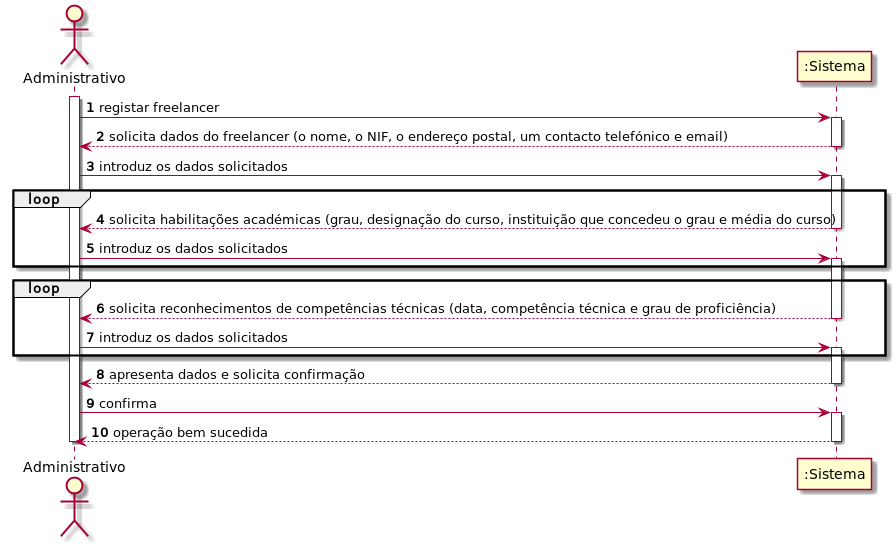
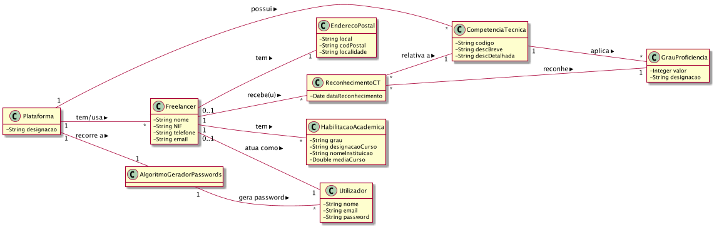
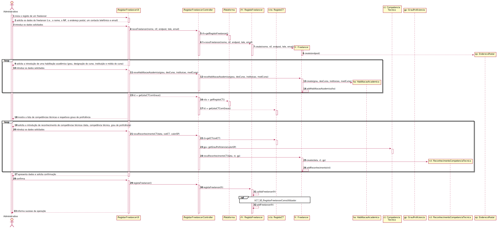
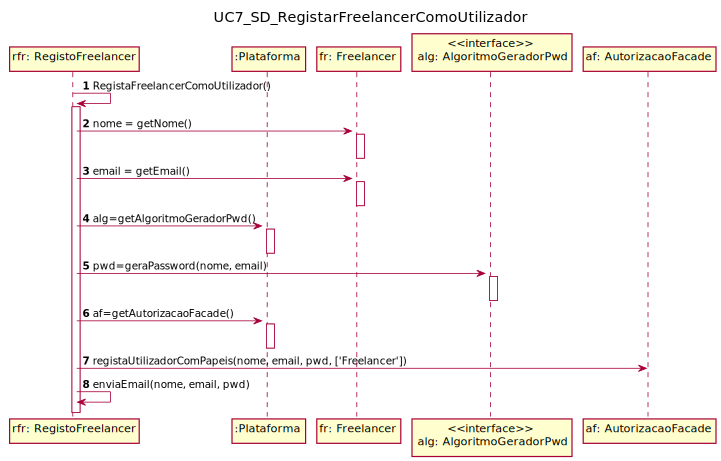
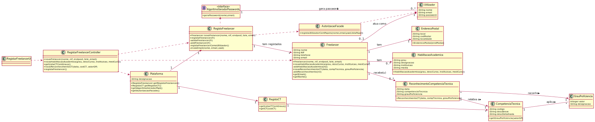
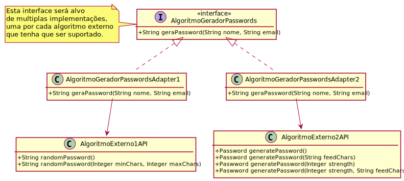

# UC 7 - Registar Freelancer

## 1. Engenharia de Requisitos

### Formato Breve
O administrativo inicia o registo de um freelancer. O sistema solicita os dados que caracterizam o freelancer (i.e., o nome, 
o NIF, o endereço postal, um contacto telefónico e email), as suas habilitações académicas (grau, designação do curso, instituição 
que concedeu o grau e média do curso) e os reconhecimentos de competências técnicas (data, competência técnica, grau de proficiência) que lhe foram atribuídos . O administrador introduz os dados solicitados. O sistema 
valida e apresenta os dados, pedindo que os confirme. O administrador confirma. O sistema regista os dados do freelancer,cria um utilizador para o freelancer e envia-lhe por e-mail os dados de acesso à plataforma e, por fim, informa o administrativo do sucesso da operação.

### SSD

### Formato Completo

#### Ator principal

Administrativo

#### Partes interessadas e seus interesses
**Administrativo:** pretende registar freelancer no sistema para que este possa utilizar a plataforma.

**Freelancer:** pretende usufruir das funcionalidades disponibilizadas pela plataforma.

**T4J:** pretende que o freelancer em causa esteja registado no sistema de modo a utilizar a plataforma.

#### Pré-condições

n/a

#### Pós-condições
* A informação do registo do Freelancer é guardada no sistema.
* É criado um utilizador na plataforma para o Freelancer.
* É enviado um email ao Freelancer com a informação de acesso à plataforma.

#### Cenário de sucesso principal (ou fluxo básico)

1. O administrativo inicia o registo de um freelancer. 
2. O sistema solicita os dados que caracterizam o freelancer (i.e., o nome, o NIF, o endereço postal, um contacto telefónico e email).
3. O administrativo introduz os dados solicitados.
4. O sistema solicita a introdução de uma habilitação académica (grau, designação do curso, instituição que concedeu o grau e média do curso).
5. O administrativo introduz os dados solicitados.
6. Os passos 4-5 repetem-se até que o administrativo tenha introduzido todas as habilitações académicas do freelancer.
7. O sistema mostra a lista de competências técnicas e respetivos graus de proficiência e solicita a introdução de reconhecimento de competências técnicas (data, competência técnica, grau de proficiência) atribuídas.
8. O administrativo introduz os dados solicitados.
9. Os passos 7-8 repetem-se até que o administrativo tenha introduzido todos os reconhecimento de competências técnicas do freelancer.
10. O sistema valida e apresenta os dados, pedindo que os confirme. 
11. O administrador confirma. 
12. O sistema regista os dados do freelancer,cria um utilizador para o freelancer e envia-lhe por e-mail os dados de acesso à plataforma e, por fim, informa o administrativo do sucesso da operação.

#### Extensões (ou fluxos alternativos)

*a. O administrativo solicita o cancelamento da registo.

> O caso de uso termina.

10a. Dados de Endereço Postal incompletos.
>	1. O sistema informa quais os dados em falta.
>	2. O sistema permite a introdução dos dados em falta (passo 3)
>
	>	2a. O administrativo não altera os dados. O caso de uso termina.
	
10b. Dados mínimos obrigatórios em falta.
>	1. O sistema informa quais os dados em falta.
>	2. O sistema permite a introdução dos dados em falta (passo 3)
>
	>	2a. O administrativo não altera os dados. O caso de uso termina.

11c. O sistema deteta que os dados (ou algum subconjunto dos dados) introduzidos **(e.g. email) **devem ser únicos e que já existem no sistema.
>	1. O sistema alerta o administrativo para o facto.
>	2. O sistema permite a sua alteração (passo 3)
>
	>	2a. O administrativo não altera os dados. O caso de uso termina.

#### Requisitos especiais
* **A password deve ser gerada pela plataforma recorrendo a um algoritmo externo (i.e. concebido por terceiros)**

#### Lista de Variações de Tecnologias e Dados
\-

#### Frequência de Ocorrência
\-

#### Questões em aberto

* Existem outros dados obrigatórios para além dos já conhecidos?
* Quais os dados que em conjunto permitem detetar a duplicação de freelancers?
* É necessário fazer uma operação de negócio usando as habilitações académicas? Quais?
* O processo conduzido pela departamento de RH precisa de ser considerado no sistema a desenvolver?
* Qual a frequência de ocorrência deste caso de uso?

## 2. Análise OO

### Excerto do Modelo de Domínio Relevante para o UC

## 3. Design - Realização do Caso de Uso

### Racional

| Fluxo Principal | Questão: Que Classe... | Resposta  | Justificação  |
|:--------------  |:---------------------- |:----------|:---------------------------- |
|1. O administrativo inicia o registo de um freelancer. |... interage com o administrativo?| RegistarFreelancerUI |Pure Fabrication|
| |... coordena o UC?| RegistarFreelancerController |Controller|
| |... cria instâncias de Freelancer?|RegistoFreelancer|Creator(regra1) combinado com HC+LC sobre Plataforma.|
|2. O sistema solicita os dados que caracterizam o freelancer (i.e., o nome, o NIF, o endereço postal, um contacto telefónico e email).||||
|3. O administrativo introduz os dados solicitados. |... guarda os dados introduzidos?|Freelancer, EnderecoPostal| IE: instância criada no passo 1|
| |... cria instâncias de EnderecoPostal?|Freelancer|creator(regra1)|
|4. O sistema solicita a introdução de uma habilitação académica (grau, designação do curso, instituição que concedeu o grau e média do curso).||||
|5. O administrativo introduz os dados solicitados. |... guarda os dados introduzidos?|Freelancer, HabilitacaoAcademica| IE: instância criada no passo 1|
| |... cria instâncias de HabilitacaoAcademica?|Freelancer|creator(regra1)|
|6. Os passos 4-5 repetem-se até que o administrativo tenha introduzido todas as habilitações académicas do freelancer.|||| 
|7. O sistema mostra a lista de competências técnicas e respetivos graus de proficiência e solicita a introdução de reconhecimento de competências técnicas atribuídas.|...conhece as CT?|RegistoCT|Plataforma tem um RegistoCT (cf. UC 4).|
| |...conhece os graus de proficiência|CT|IE.: Cada CT conhece os seus graus de proeficiência.|
|8. O administrativo introduz os dados solicitados. |... guarda os dados introduzidos?|Freelancer, ReconhecimentoCompetenciaTecnica| IE: instância criada no passo 1|
| |... cria instâncias de ReconhecimentoCompetenciaTecnica?|Freelancer|creator(regra1)|
|9. Os passos 7-8 repetem-se até que o administrativo tenha introduzido todos os reconhecimento de competências técnicas do freelancer.|||| 
|10. O sistema valida e apresenta os dados, pedindo que os confirme. |... valida os dados do Freelancer (validação local)|Freelancer|IE: possui os seus próprios dados|
| |... valida os dados das habilitações académicas (validação local)| HabilitacaoAcademica|IE: possui os seus próprios dados|
| |... valida os dados das habilitações académicas (validação global)| Freelancer |IE: Freelancer possui as suas habilitações académicas|
| |... valida os dados dos reconhecimentos de competências técnicas (validação local)|ReconhecimentoCompetenciaTecnica|IE: possui os seus próprios dados|
| |... valida os dados dos reconhecimentos de competências técnicas (validação global)| Freelancer |IE: Freelancer possui os seus reconhecimentos|
| |... valida os dados do Freelancer (validação global)|RegistoFreelancer|IE: O RegistoFreelancer tem registados Freelancer|
|11. O administrador confirma.  ||||
|12. O sistema regista os dados do freelancer,cria um utilizador para o freelancer e envia-lhe por e-mail os dados de acesso à plataforma e, por fim, informa o administrativo do sucesso da operação. |... guarda o Freelancer criado?| RegistoFreelancer |IE: No MD a Plataforma tem  Organizacao|
| |... regista/guarda o Utilizador referente ao Freelancer?|AutorizacaoFacade|IE. A gestão de utilizadores é responsabilidade do componente externo respetivo cujo ponto de interação é através da classe "AutorizacaoFacade"|
| |... gera a password do Freelancer?| AlgoritmoGeradorPasswords|	IE: no MD o AlgoritmoGeradorPasswords gera password de Utilizador.|
| | ...conhece o AlgoritmoExternoGeracaoPwd?|Plataforma|IE: no MD a Plataforma recorre a AlgoritmoGeradorPasswords.|
| |...implementa as particularidades de cada algoritmo externo em concreto?| AlgoritmoGeradorPasswords| Protected Variation + Adapter|
| |...envia, por email, os dados de acesso ao Freelancer?| RegistoFreelancer| IE: possui os dados para o fazer.|

### Sistematização ##

 Do racional resulta que as classes conceptuais promovidas a classes de software são:

 * Plataforma
 * Freelancer
 * HabilitacaoAcademica
 * ReconhecimentoCompetenciaTecnica
 * EnderecoPostal
 * CompetênciaTécnica
 * GrauProficiencia
 * AlgoritmoGeradorPasswords

Outras classes de software (i.e. Pure Fabrication) identificadas:  

 * RegistarFreelancerUI  
 * RegistarFreelancerController
 * RegistoFreelancer
 * RegistoCT
 

###	Diagrama de Sequência

**Nota:** 
Atentem na questão do endereço postal no mensagem 7 e 8:

* Na mensagem 7 é enviado como uma string e;
* ficou o Freelancer com a responsabilidade de instanciar EnderecoPostal no seu construtor (mensagem 8). 

Desta forma evita-se o método estático na classe Freelancer.

**Esta é uma alternativa mais interessante do que a adotada no UC 1.**

###	Diagrama de Classes

---

