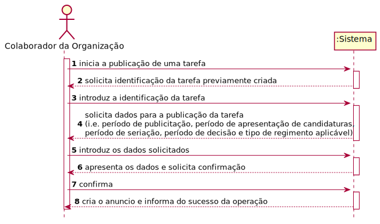
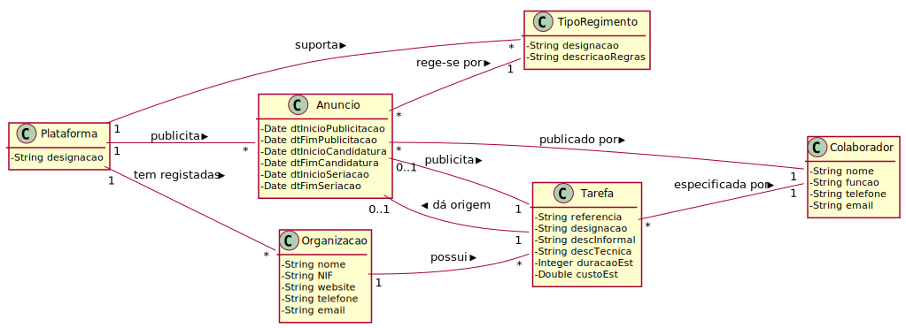
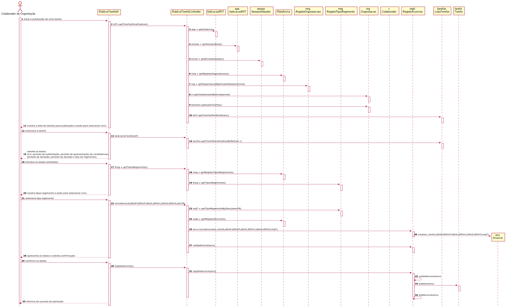
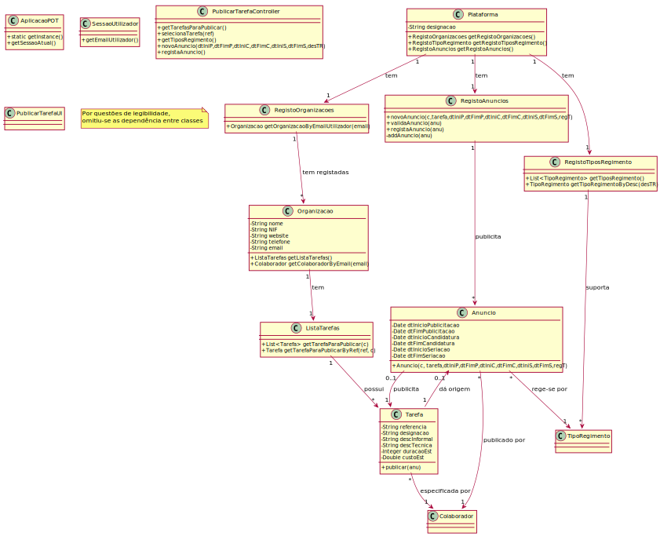

# UC 8 - Publicar Tarefa

## 1. Engenharia de Requisitos

### Formato Breve

O colaborador da organização inicia a publicação de uma tarefa. O sistema solicita a identificação da tarefa previamente criada pelo colaborador da organização. O colaborador identifica a tarefa. O sistema solicita os dados necessários para a publicação da tarefa (i.e. período de publicitação, período de apresentação de candidaturas, período de seriação, período de decisão e tipo de regimento aplicável). O colaborador da organização introduz os dados solicitados. O sistema valida e apresenta os dados ao colaborador da organização e pede a sua confirmação. O colaborador da organização confirma. O sistema regista os dados e cria um anúncio e informa o colaborador do sucesso da operação.

### SSD

### Formato Completo

#### Ator principal

* Colaborador de Organização

#### Partes interessadas e seus interesses
* **Colaborador de Organização:** pretende publicar tarefas.
* **Organização:** pretende que os seus colaboradores possam publicar tarefas para posterior publicação.
* **Freelancer:** pretende conhecer os anuncios a que se pode candidatar.
* **T4J:** pretende a adjudicação de tarefas a freelancers.

#### Pré-condições

* Existencia de regimentos definidos no sistema.

#### Pós-condições

* É registado um anúncio relativo à publicação da tarefa.

#### Cenário de sucesso principal (ou fluxo básico)

1. O colaborador da organização inicia a publicação de uma tarefa.
2. O sistema apresenta **as tarefas criadas pelo colaborador da organização e que ainda não foram alvo de publicação** e pede que seja selecionada uma.
3. O colaborador da organização seleciona uma tarefa.
4. O sistema solicita os dados necessários para a publicação da tarefa (i.e. período de publicitação, período de apresentação de candidaturas, período de seriação, período de decisão).
5. O colaborador da organização introduz os dados solicitados.
6. O sistema mostra os tipos de regimentos passiveis de serem aplicados e solicita a selecção de um.
7. O colaborador seleciona o tipo de regimento pretendido.
8. O sistema valida e apresenta os dados ao colaborador da organização e pede a sua confirmação.
9. O colaborador da organização confirma.
10. O sistema regista os dados e cria o anúncio e informa o colaborador da organização do sucesso da operação.

#### Extensões (ou fluxos alternativos)

*a. O colaborador da organização solicita o cancelamento da publicação da tarefa.
> O caso de uso termina.

2a. Não existem tarefas criadas pelo colaborador da ordanização e que ainda não foram publicadas.
> O caso de uso termina.

8a. Dados mínimos obrigatórios em falta.
>	1. O sistema informa quais os dados em falta.
>	2. O sistema permite a introdução dos dados em falta (passo 4)
    >
	>	2a. O colaborador de organização não altera os dados. O caso de uso termina.

8b. O sistema deteta que os dados introduzidos (ou algum subconjunto dos dados) são inválidos.
>   1. O sistema alerta o colaborador de organização para o facto.
>   2. O sistema permite a sua alteração (passo 5).
>
	> 2a. O colaborador da organização não altera os dados. O caso de uso termina.

#### Requisitos especiais
\-

#### Lista de Variações de Tecnologias e Dados
\-

#### Frequência de Ocorrência
\-

#### Questões em aberto

* O anúncio tem algum identificar único próprio (i.e. diferente do da tarefa)?
* Existe alguma restrição relativamente aos vários períodos solicitados? 
* Qual a frequência de ocorrência deste caso de uso?

## 2. Análise OO

### Excerto do Modelo de Domínio Relevante para o UC

## 3. Design - Realização do Caso de Uso

### Racional

| Fluxo Principal | Questão: Que Classe... | Resposta  | Justificação  |
|:--------------  |:---------------------- |:----------|:---------------------------- |
| 1. O colaborador da organização inicia a publicação de uma tarefa.|... interage com o utilizador?|PublicarTarefaUI|Pure Fabrication|
|  		 |	... coordena o UC?	| PublicarTarefaController | Controller    |
| |...conhece o utilizador/gestor a usar o sistema?|SessaoUtilizador|IE: cf. documentação do componente de gestão de utilizadores.|
| |...sabe a que organização o utilizador/colaborador pertence?|RegistoOrganizacoes|IE: conhece todas as organizações.|
| ||Organização|IE: conhece os seus colaboradores.|
| |...conhece o RegistoOrganizacoes?|Plataforma|IE: Plataforma tem RegistoOrganizacoes|
| 2. O sistema **as tarefas criadas pelo colaborador da organização e que ainda não foram alvo de publicação** e pede que seja selecionada uma.|... conhece as tarefas? |Organização|IE: no MD a Organização possui Tarefas. |
| | |ListaTarefas|IE: no MD a Organização possui Tarefas. Por aplicação de HC+LC delega a ListaTarefas|
| |	... cria instância de Anuncio? | RegistoAnuncios | Creator (Regra1): no MD a Plataforma publica Anuncio e por HC+LC delega em RegistoAnúncio|
| 3. O colaborador da organização seleciona uma tarefa. |... guarda a tarefa selecionada?|Anúncio|IE|
| 4. O sistema solicita os dados necessários para a publicação da tarefa (i.e. período de publicitação, período de apresentação de candidaturas, período de seriação, período de decisão) |N/A|||
| 5. O colaborador da organização introduz os dados solicitados. | ... guarda os dados introduzidos?|Anuncio| IE: Anuncio conhece os seus dados|
|6. O sistema mostra os tipos de regimentos passiveis de serem aplicados e solicita a selecção de um.| ...conhece os tipos de regimento?|RegistoTiposRegimento|IE+HC/LC a Plataforma que no MD suporta vários Tipo de Regimento.|
|7. O colaborador seleciona o tipo de regimento pretendido.|...guarda o tipo de regimento selecionado?|Anúncio|IE. Anuncio rege-se por um Tipo Regimento|
| 8. O sistema valida e apresenta os dados ao colaborador da organização e pede a sua confirmação.|	... valida os dados do Anuncio (validação local)?|Anuncio| IE: possui os seus próprios dados.|
| |	... valida os dados do Anuncio (validação global)?| RegistoAnuncios| IE: por delegação da Plataforma|
| 8. O colaborador da organização confirma. | N/A|||
| 10. O sistema regista os dados e cria o anúncio e informa o colaborador da organização do sucesso da operação. |...guarda o Anuncio?| RegistoAnuncios|IE|
| |...informa o colaborador?|PublicarTarefaUI|

### Sistematização ##

 Do racional resulta que as classes conceptuais promovidas a classes de software são:

 * Plataforma
 * Tarefa
 * Organização
 * Anuncio

Outras classes de software (i.e. Pure Fabrication) identificadas:  

 * PublicarTarefaUI  
 * PublicarTarefaController
 * RegistoAnuncios
 * RegistoTipoRegimento
 * RegistoOrganizacoes
 * ListaTarefas
 
Outras classes de sistemas/componentes externos:

 * SessaoUtilizador

###	Diagrama de Sequência

###	Diagrama de Classes

