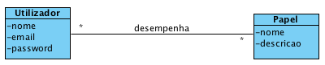
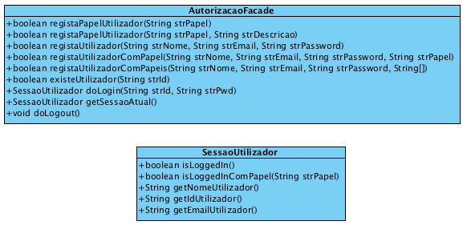

# Gestão de Utilizadores - Documentação
O componente de gestão de utilizadores foi desenvolvido por outra equipa de desenvolvimento que também é responsável pela sua manutenção/evolução. Este componente visa satisfazer um conjunto de requisitos/funcionalidades genéricas e comuns a várias aplicações.

Os conceitos principais abordados neste componente estão representados no modelo de domínio apresentado de seguida. 

 

De acordo com o mesmo, um _“Utilizador”_ desempenha vários _“Papel”_ (i.e. funções), sendo que o mesmo _“Papel”_ também pode ser desempenhado por vários _“Utilizador”_.

Este componente disponibiliza as suas funcionalidades aos outros sistemas através de um ponto único de acesso (i.e. uma classe de software) denominado _“AutorizacaoFacade”_. Desta forma, a estrutura interna do componente pode ser alterada sem afetar as aplicações que estão a usar este componente.

Assim sendo, a documentação relevante com vista à sua reutilização consiste na descrição das classes _“AutorizacaoFacade”_ e _“SessãoUtilizador”_ (cf. diagrama de classes). A primeira disponibiliza os seguintes métodos:

* **_“boolean registaPapelUtilizador(String strPapel)”_**: permite definir a existência de um novo papel/função de interesse para a aplicação;
* **_“boolean registaPapelUtilizador(String strPapel, String strDescricao)”_**: semelhante ao método anterior, com a diferença de permitir associar uma descrição a esse papel/função;
* **_“boolean registaUtilizador(String strNome, String strEmail, String strPassword)”_**: permite definir a existência de um novo utilizador que pode usar a aplicação;
* **_“boolean registaUtilizadorComPapel(String strNome, String strEmail, String strPassword, String strPapel)”_**: semelhante ao método anterior, com a vantagem de associar imediatamente um papel/função a esse utilizador; 
* **_“boolean registaUtilizadorComPapeis(String strNome, String strEmail, String strPassword, String[] papeis)”_**: semelhante ao método anterior, com a diferença de poder associar imediatamente mais do que um papel/função a esse utilizador;
* **_“boolean existeUtilizador(String strId)”_**: permite saber se existe algum utilizador no sistema que seja identificável pelo identificador (strId) especificado;
* **_“SessaoUtilizador doLogin(String strId, String strPwd)”_**: permite autenticar um utilizador com vista à utilização da aplicação. O resultado é uma sessão de utilizador (i.e. classe **_SessaoUtilizador_**);
* **_“SessaoUtilizador getSessaoAtual()”_**: retorna (se existir) a sessão de utilizador ativa;
* **_“void doLogout()”_**: termina a sessão de utilizador que estiver ativa no momento.

 

Uma sessão de utilizador (SessaoUtilizador) disponibiliza os seguintes métodos:

* **_“boolean isLoggedIn()”_**: indica se a sessão possui efetivamente um utilizador autenticado com sucesso ou não; 
* **_“boolean isLoggedInComPapel(String strPapel)”_**: indica se o utilizador afeto à sessão possui o papel/função especificado como parâmetro;
* **_“String getNomeUtilizador()”_**: retorna o nome do utilizador afeto à sessão;
* **_“String getIdUtilizador()”_**: retorna o identificador do utilizador afeto à sessão; 
* **_“String getEmailUtilizador()”_**: retorna o email do utilizador afeto à sessão.

Por fim, salienta-se que o identificador dos utilizadores é o meio mais adequado para que as aplicações que usam este componente relacionem os utilizadores do sistema com classes/objetos específicos do domínio de aplicação.

